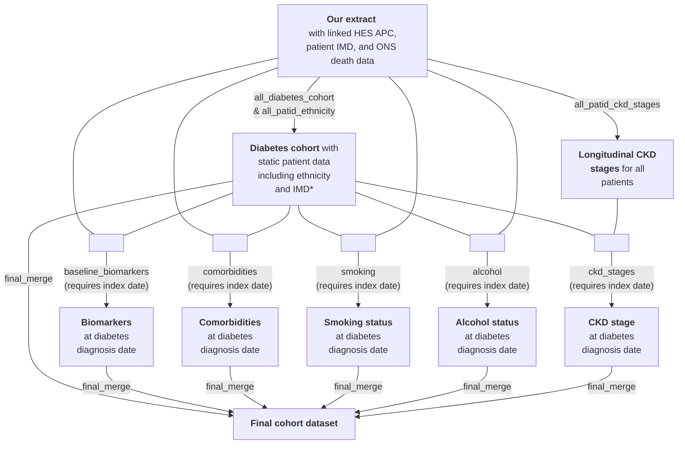

# At-diagnosis cohort

The 'at-diagnosis' cohort (n=771,678) consists of all those in the diabetes cohort (n=1,138,179; see [flow diagram](https://github.com/Exeter-Diabetes/CPRD-Cohort-scripts/blob/main/README.md#introduction)) with a valid diagnosis date (i.e. excluding those with a diagnosis date set to missing as it was with -30 to +90 days of the registration start date, n=60,530). Additionally, those with a diagnosis date before registration start were excluded (additional n=305,971). The cohort dataset includes biomarker/comorbidity/sociodemographic info at diabetes diagnosis date.

&nbsp;

## Script overview

The below diagram shows the R scripts (in grey boxes) used to create the at-diagnosis cohort. The diabetes diagnosis dates from the "all_diabetes_cohort" script are required to define the baseline biomarkers, comorbidities, smoking status, alcohol status and CKD stage at diagnosis.

\*IMD=Index of Multiple Deprivation; 'static' because we only have data from 2019 so only 1 value per patient.

The scripts shown in the above diagram (in grey boxes) can be found in this directory, except those which are common to the other cohorts (all_diabetes_cohort, all_patid_ethnicity, and all_patid_ckd_stages) which are in the upper directory of this repository.

&nbsp;

## Script details

'Outputs' are the primary MySQL tables produced by each script. See also notes on the [aurum package](https://github.com/Exeter-Diabetes/CPRD-analysis-package) and [CPRD-Codelists respository](https://github.com/Exeter-Diabetes/CPRD-Codelists) in the upper directory of this repository ([here](https://github.com/Exeter-Diabetes/CPRD-Cohort-scripts#script-details)).

| Script description | &nbsp;&nbsp;&nbsp;&nbsp;&nbsp;&nbsp;&nbsp;&nbsp;&nbsp;&nbsp;&nbsp;&nbsp;&nbsp;&nbsp;&nbsp;&nbsp;&nbsp;&nbsp;&nbsp;&nbsp;&nbsp;&nbsp;&nbsp;&nbsp;&nbsp;&nbsp;&nbsp;&nbsp;&nbsp;&nbsp;&nbsp;&nbsp;&nbsp;&nbsp;Outputs&nbsp;&nbsp;&nbsp;&nbsp;&nbsp;&nbsp;&nbsp;&nbsp;&nbsp;&nbsp;&nbsp;&nbsp;&nbsp;&nbsp;&nbsp;&nbsp;&nbsp;&nbsp;&nbsp;&nbsp;&nbsp;&nbsp;&nbsp;&nbsp;&nbsp;&nbsp;&nbsp;&nbsp;&nbsp;&nbsp;&nbsp;&nbsp;&nbsp;&nbsp; |
| ---- | ---- |
| **all_patid_ckd_stages**: uses eGFR calculated from serum creatinine to define longitudinal CKD stages for all patids as per [our algorithm](https://github.com/Exeter-Diabetes/CPRD-Codelists#ckd-chronic-kidney-disease-stage) |  **all_patid_ckd_stages_from_algorithm**:  1 row per patid, with onset of different CKD stages in wide format |
| **all_patid_ethnicity**: uses GP and linked HES data to define ethnicity as per [our algorithm](https://github.com/Exeter-Diabetes/CPRD-Codelists#ethnicity)  | **all_patid_ethnicity**:  1 row per patid, with 5-category, 16-category and QRISK2-category ethnicity (where available) |
| **all_diabetes_cohort**: table of patids meeting the criteria for our mixed Type 1/Type 2/'other' diabetes cohort plus additional patient variables | **all_diabetes_cohort**: 1 row per patid of those in the diabetes cohort, with diabetes diagnosis dates, DOB, gender, ethnicity etc. |
|**at_diag_baseline_biomarkers**: pulls biomarkers value at cohort index dates | **at_diag_baseline_biomarkers**: 1 row per patid (as there are no patids with >1 index date) with all biomarker values at index date where available (including HbA1c and height) |
|**at_diag_comorbidities**: finds onset of comorbidities relative to cohort index dates | **at_diag_comorbidities**:  1 row per patid (as there are no patids with >1 index date) with earliest pre-index date code occurrence, latest pre-index date code occurrence, and earliest post-index date code occurrence |
|**at_diag_smoking**: finds smoking status at cohort index dates | **at_diag_smoking**: 1 row per patid (as there are no patids with >1 index date) with smoking status and QRISK2 smoking category at index date where available |
|**at_diag_alcohol**: finds alcohol status at cohort index dates | **at_diag_alcohol**: 1 row per patid (as there are no patids with >1 index date) with alcohol status at index date where available |
|**at_diag_ckd_stages**: finds onset of CKD stages relative to cohort index dates | **at_diag_ckd_stages**: 1 row per patid (as there are no patids with >1 index date) with baseline CKD stage at index date where available |
|**at_diag_final_merge**: brings together variables from all of the above tables | **at_diag_final_merge**: 1 row per patid -(as there are no patids with >1 index date) with relevant biomarker/comorbidity/smoking/alcohol variables |

&nbsp;

## Data dictionary of variables in 'at_diag_final_merge' table

Biomarkers included: HbA1c (mmol/mol), weight (kg), height (m), BMI (kg/m2), fasting glucose (mmol/L), HDL (mmol/L), triglycerides (mmol/L), blood creatinine (umol/L), LDL (mmol/L), ALT (U/L), AST (U/L), total cholesterol (mmol/L), DBP (mmHg), SBP (mmHg), ACR (mg/mmol / g/mol), blood albumin (g/L), total bilirubin (umol/L), haematocrit (%), haemoglobin (g/L), PCR (mg/mmol / g/mol), urine albumin (mg/L), urine creatinine (mmol/L) (latter two not included separately but combined where on the same day to give 'acr_from_separate' values). NB: BMI is from BMI codes only, not calculated from weight+height.

Comorbidities included: atrial fibrillation, angina (overall and specifically unstable angina recorded in hospital), anxiety, asthma, benign prostate hyperplasia, bronchiectasis, CKD stage 5/ESRD, CLD, COPD, cystic fibrosis, dementia, diabetic nephropathy, DKA (hospital data only), falls, family history of diabetes, family history of premature cardiovascular disease, mild/moderate/severe frailty, haematological cancers, heart failure, major and minor amputations in hospital (doesn't only include primary cause), hypertension (uses primary care data only, see note in script), IHD, lower limb fracture, myocardial infarction (overall and more specifically in hospital with a reduced codelists: 'incident_mi'), neuropathy, osteoporosis, other neurological conditions, PAD, photocoagulation therapy (hospital data only), pulmonary fibrosis, pulmonary hypertension, retinopathy, (coronary artery) revascularisation, rhematoid arthritis, solid cancer, solid organ transplant, stroke (overall and more specifically in hospital with a reduced codelists: 'incident_stroke'), TIA, vitreous haemorrhage (hospital data only), 'primary_hhf' (hospitalisation for HF with HF as primary cause), 'primary_incident_mi' (hospitalisation for MI with MI as primary cause using incident_mi codelist), 'primary_incident_stroke' (hospitalisation for stroke with stroke as primary cause using incident_stroke codelist), osmotic symptoms (micturition control, volume depletion, urinary frequency).

| Variable name | Description | Notes on derivation |
| --- | --- | --- |
| patid | unique patient identifier | |
| gender | gender (1=male, 2=female) | |
| dob | date of birth | if month and date missing, 1st July used, if date but not month missing, 15th of month used, or earliest medcode in year of birth if this is earlier |
| pracid | practice ID | |
| prac_region | practice region: 1=North East, 2=North West, 3=Yorkshire And The Humber, 4=East Midlands, 5=West Midlands, 6=East of England, 7=South West, 8=South Central, 9=London, 10=South East Coast, 11 Northern Ireland, 12 Scotland, 13 Wales | |
| ethnicity_5cat | 5-category ethnicity: (0=White, 1=South Asian, 2=Black, 3=Other, 4=Mixed) | Uses [our algorithm](https://github.com/Exeter-Diabetes/CPRD-Codelists#ethnicity) (NB: use all medcodes; no date restrictions): Use most frequent category If multiple categories with same frequency, use latest one If multiple categories with same frequency and used as recently as each other, label as missing Use HES if missing/no consensus from medcodes Note that codes for 'Other Asian' are included in category 1 (South Asian) so this group may include some East/Other Asian ('Chinese' is in category 3 [Other] rather than category 1, as per the 2001 census categories. For the 2011 census, Chinese ethnicity was included in group 1 to make an 'Asian' category.)  |
| ethnicity_16cat | 16-category ethnicity: (0=missing, 1=White British, 2=White Irish, 3=Other White, 4=White and Black Caribbean, 5=White and Black African, 6=White and Asian, 7=Other Mixed, 8=Indian, 9=Pakistani, 10=Bangladeshi, 11=Other Asian, 12=Caribbean, 13=African, 14=Other Black, 15=Chinese, 16=Other) | |
| ethnicity_qrisk2 | QRISK2 ethnicity category: (1=White, 2=Indian, 3=Pakistani, 4=Bangladeshi, 5=Other Asian, 6=Black Caribbean, 7=Black African, 8=Chinese, 9=Other) | |
| imd_decile | 2019 English Index of Multiple Deprivation (IMD) decile (1=least deprived, 10=most deprived) | |
| has_insulin | has a prescription for insulin ever (excluding invalid dates - before DOB / after gp_end_date) | |
| type1_code_count | number of Type 1-specific codes in records (any date) | |
| type2_code_count | number of Type 2-specific codes in records (any date) | |
| raw_dm_diag_dmcodedate | earliest diabetes medcode (including diabetes exclusion codes; excluding those with obstypeid=4 (family history) and invalid dates). 'Raw' indicates that this is before codes in the year of birth are removed for those with Type 2 diabetes | |
| raw_dm_diag_date_all | diabetes diagnosis date | earliest of raw_dm_diag_dmcodedate, dm_diag_hba1cdate, dm_diag_ohadate, and dm_diag_insdate. |
| dm_diag_dmcodedate | earliest diabetes medcode (including diabetes exclusion codes; excluding those with obstypeid=4 (family history) and invalid dates). Codes in year of birth removed for those with Type 2 diabetes | |
| dm_diag_hba1cdate | earliest HbA1c >47.5 mmol/mol (excluding invalid dates, including those with valid value and unit codes only) | |
| dm_diag_ohadate | earliest OHA prescription (excluding invalid dates) | |
| dm_diag_insdate | earliest insulin prescription (excluding invalid dates) | |
| dm_diag_date | diabetes diagnosis date | earliest of dm_diag_dmcodedate, dm_diag_hba1cdate, dm_diag_ohadate, and dm_diag_insdate, but note that cohort only excludes those with diagnosis before or up to 90 days (inclusive) after registration start) It's worth noting that we have a number of people classified as Type 2 who appear to have been diagnosed at a young age, which is likely to be a coding error. This small proportion shouldn't affect any analysis results greatly, but might need to be considered for other analysis |
| dm_diag_codetype | whether diagnosis date represents diabetes medcode (1), high HbA1c (2), OHA prescription (3) or insulin (4) - if multiple on same day, use lowest number | |
| dm_diag_age | age at diabetes diagnosis | dm_diag_date - dob See above note next to dm_diag_date variable on young diagnosis in T2Ds |
| dm_diag_before_reg | whether diagnosed before registration | |
| ins_in_1_year | whether started insulin within 1 year of diagnosis (**0 may mean no or missing**) | |
| current_oha | whether prescription for OHA (non-insulin diabetes medication) within last 6 months of data | last 6 months of data = those before gp_end_date |
| diabetes_type | diabetes type | See [algorithm](https://github.com/Exeter-Diabetes/CPRD-Codelists#diabetes-algorithms) See above note next to dm_diag_date_all variable on young diagnosis in T2Ds |
| regstartdate | registration start date | |
| gp_end_date | earliest of last collection date from practice and deregistration | |
| death_date | ONS death date | NA if no death date |
| with_hes | 1 for patients with HES linkage, otherwise 0| |
| pre{biomarker} | biomarker value at baseline | For all biomarkers except HbA1c: pre{biomarker} is closest biomarker to index date within window of -730 days (2 years before index date) and +7 days (a week after index date)  For HbA1c: prehba1c is closest HbA1c to index date within window of -183 days (6 months before index date) and +7 days (a week after index date) |
| pre{biomarker}date | date of baseline biomarker | |
| pre{biomarker}datediff | days between index date and baseline biomarker (negative: biomarker measured before index date) | |
| height | height in cm | Mean of all values on/post-index date |
| preckdstage | CKD stage at baseline | CKD stages calculated as per [our algorithm](https://github.com/Exeter-Diabetes/CPRD-Codelists#ckd-chronic-kidney-disease-stage) eGFR calculated from creatinine using CKD-EPI creatinine 2021 equation Start date = earliest test for CKD stage, only including those confirmed by another test at least 91 days later, without a test for a different stage in the intervening period Baseline stage = maximum stage with start date < index date or up to 7 days afterwards CKD5 supplemented by medcodes/ICD10/OPCS4 codes for CKD5 / ESRD |
| preckdstagedate | date of onset of baseline CKD stage (earliest test for this stage) | |
| preckdstagedatediff | days between index date and preckdstagedate | |
| pre_index_date_earliest_{comorbidity} | earliest occurrence of comorbidity before/at index date | |
| pre_index_date_latest_{comorbidity} | latest occurrence of comorbidity before/at index date | |
| pre_index_date_{comorbidity} | binary 0/1 if any instance of comorbidity before/at index date | |
| post_index_date_first_{comorbidity} | earliest occurrence of comorbidity after (not at) index date | |
| smoking_cat | Smoking category at index date: Non-smoker, Ex-smoker or Active smoker | Derived from [our algorithm](https://github.com/Exeter-Diabetes/CPRD-Codelists#smoking) |
| qrisk2_smoking_cat | QRISK2 smoking category code (0-4) | |
| qrisk2_smoking_cat_uncoded | Decoded version of qrisk2_smoking_cat: 0=Non-smoker, 1= Ex-smoker, 2=Light smoker, 3=Moderate smoker, 4=Heavy smoker | |
| alcohol_cat | Alcohol consumption category at index date: None, Within limits, Excess or Heavy | Derived from [our algorithm](https://github.com/Exeter-Diabetes/CPRD-Codelists#alcohol) |
