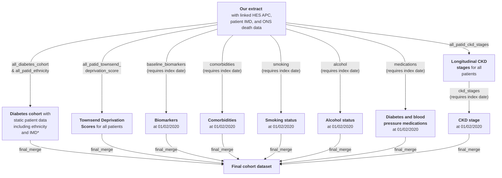

# Prevalent cohort

The prevalent cohort consists of those actively registered on 01/02/2020 (the index date) who have a diabetes diagnosis before/on this date, and who have linked HES records (with n_patid_hes<=20), with added biomarker/comorbidity/sociodemographic/medication info at this date.

In addition to the 'template scripts' in the upper directory of this repository, the prevalent cohort additionally uses an 'all_patid_townsend_deprivation_score.R' script to estimate Townsend Deprivation Scores from IMD scores (used for QRISK2 and QDiabetes-Heart Failure scores), and a 'medications' script to define diabetes and blood pressure medication scripts relative to the index date (the latter is required for QRISK2). In addition to defining age and duration of diabetes at index date as in the template version, the 'final_merge' script also calculates QRISK2 (2017; 5-year and 10-year) and QDiabetes-Heart Failure (2015) scores at index date. See below for script overview.

&nbsp;

## Script overview

The below diagram shows the R scripts (in grey boxes) used to create the prevalent cohort.

\*IMD=Index of Multiple Deprivation; 'static' because we only have data from 2019 so only 1 value per patient. As Townsend Deprivation Scores are derived from these, they are also 'static'.

The scripts shown in the above diagram (in grey boxes) can be found in this directory, except those which are common to the other cohorts (all_diabetes_cohort, all_patid_ethnicity, and all_patid_ckd_stages) which are in the upper directory of this repository.

&nbsp;

## Script details

'Outputs' are the primary MySQL tables produced by each script. See also notes on the [aurum package](https://github.com/Exeter-Diabetes/CPRD-analysis-package) and [CPRD-Codelists respository](https://github.com/Exeter-Diabetes/CPRD-Codelists) in the upper directory of this repository ([here](https://github.com/Exeter-Diabetes/CPRD-Cohort-scripts#script-details)).

| Script description | &nbsp;&nbsp;&nbsp;&nbsp;&nbsp;&nbsp;&nbsp;&nbsp;&nbsp;&nbsp;&nbsp;&nbsp;&nbsp;&nbsp;&nbsp;&nbsp;&nbsp;&nbsp;&nbsp;&nbsp;&nbsp;&nbsp;&nbsp;&nbsp;&nbsp;&nbsp;&nbsp;&nbsp;&nbsp;&nbsp;&nbsp;&nbsp;&nbsp;&nbsp;Outputs&nbsp;&nbsp;&nbsp;&nbsp;&nbsp;&nbsp;&nbsp;&nbsp;&nbsp;&nbsp;&nbsp;&nbsp;&nbsp;&nbsp;&nbsp;&nbsp;&nbsp;&nbsp;&nbsp;&nbsp;&nbsp;&nbsp;&nbsp;&nbsp;&nbsp;&nbsp;&nbsp;&nbsp;&nbsp;&nbsp;&nbsp;&nbsp;&nbsp;&nbsp; |
| ---- | ---- |
| **all_patid_ckd_stages**: uses eGFR calculated from serum creatinine to define longitudinal CKD stages for all patids as per [our algorithm](https://github.com/Exeter-Diabetes/CPRD-Codelists#ckd-chronic-kidney-disease-stage) |  **all_patid_ckd_stages_from_algorithm**:  1 row per patid, with onset of different CKD stages in wide format |
| **all_patid_ethnicity**: uses GP and linked HES data to define ethnicity as per [our algorithm](https://github.com/Exeter-Diabetes/CPRD-Codelists#ethnicity)  | **all_patid_ethnicity**:  1 row per patid, with 5-category, 16-category and QRISK2-category ethnicity (where available) |
| **all_diabetes_cohort**: table of patids meeting the criteria for our mixed Type 1/Type 2/'other' diabetes cohort plus additional patient variables | **all_diabetes_cohort**: 1 row per patid of those in the diabetes cohort, with diabetes diagnosis dates, DOB, gender, ethnicity etc. |
| **all_patid_townsend_deprivation_score**: approximate Townsend Deprivation Scores of all patids in download | **all_patid_townsend_score**: 1 row per patid with approximate Townsend Deprivation Scores derived from Index of Multiple Deprivation scores |
|**prev_baseline_biomarkers**: pulls biomarkers value at cohort index dates | **prev_baseline_biomarkers**: 1 row per patid (as there are no patids with >1 index date) with all biomarker values at index date where available (including HbA1c and height) |
|**prev_comorbidities**: finds onset of comorbidities relative to cohort index dates | **prev_comorbidities**:  1 row per patid (as there are no patids with >1 index date) with earliest pre-index date code occurrence, latest pre-index date code occurrence, and earliest post-index date code occurrence |
|**prev_smoking**: finds smoking status at cohort index dates | **prev_smoking**: 1 row per patid (as there are no patids with >1 index date) with smoking status and QRISK2 smoking category at index date where available |
|**prev_alcohol**: finds alcohol status at cohort index dates | **prev_alcohol**: 1 row per patid (as there are no patids with >1 index date) with alcohol status at index date where available |
|**prev_ckd_stages**: finds onset of CKD stages relative to cohort index dates | **prev_ckd_stages**: 1 row per patid (as there are no patids with >1 index date) with baseline CKD stage at index date where available |
|**prev_medications**: finds dates of diabetes and blood pressure medication prescriptions relative to index dates | **prev_medications**: 1 row per patid (as there are no patids with >1 index date) with earliest pre-index date script, latest pre-index date script, and earliest post-index date script for diabetes / blood pressure medications where available |
|**prev_final_merge**: defines patient IDs in prevalent cohort, adds in variables from all of the above tables and additionally calculates age, diabetes duration, QRISK2 and QDiabetes-Heart Failure score at index date (where variables required are available to calculate these scores) | **prev_final_merge**: 1 row per patid -(as there are no patids with >1 index date) with relevant biomarker/comorbidity/smoking/alcohol/medication variables |

&nbsp;

## Data dictionary of variables in 'prev_final_merge' table

Biomarkers included: HbA1c (mmol/mol), weight (kg), height (m), BMI (kg/m2), HDL (mmol/L), triglycerides (mmol/L), blood creatinine (umol/L), LDL (mmol/L), ALT (U/L), AST (U/L), total cholesterol (mmol/L), DBP (mmHg), SBP (mmHg), ACR (mg/mmol / g/mol). NB: BMI and ACR are from BMI and ACR specific codes only, not calculated from weight+height / albumin+creatinine measurements.

Comorbidities included: atrial fibrillation, angina, asthma, bronchiectasis, CKD stage 5/ESRD, CLD, COPD, cystic fibrosis, dementia, diabetic nephropathy, haematological cancers, heart failure, hypertension (uses primary care data only, see note in script), IHD, myocardial infarction, neuropathy, other neurological conditions, PAD, pulmonary fibrosis, pulmonary hypertension, retinopathy, (coronary artery) revascularisation, rhematoid arthritis, solid cancer, solid organ transplant, stroke, TIA, family history of premature cardiovascular disease.

Medications included: blood pressure medications (different classes processed separately: ACE-inhibitors, beta-blockers, calcium channel blockers, thiazide-like diuretics, loop diuretics, potassium-sparing diuretics), diabetes medications (different classes processed separately: acarbose, DPP4-inhibitors, glinides, GLP1-receptor agonist, metformin, SGLT2-inhibitors, sulphonylureas, thiazolidinediones, insulin).

| Variable name | Description | Notes on derivation |
| --- | --- | --- |
| patid | unique patient identifier | |
| index_date_age | age of patient at index date (01/02/2020) in years | index_date - dob |
| index_date_dm_dur_all | diabetes duration at index date (01/02/2020) in years for all patients (see below note on dm_diag_date_all) | index_date - dm_diag_date_all |
| gender | gender (1=male, 2=female) | |
| dob | date of birth | if month and date missing, 1st July used, if date but not month missing, 15th of month used, or earliest medcode in year of birth if this is earlier |
| pracid | practice ID | |
| prac_region | practice region: 1=North East, 2=North West, 3=Yorkshire And The Humber, 4=East Midlands, 5=West Midlands, 6=East of England, 7=South West, 8=South Central, 9=London, 10=South East Coast, 11 Northern Ireland, 12 Scotland, 13 Wales | |
| ethnicity_5cat | 5-category ethnicity: (0=White, 1=South Asian, 2=Black, 3=Other, 4=Mixed) | Uses [our algorithm](https://github.com/Exeter-Diabetes/CPRD-Codelists#ethnicity) (NB: use all medcodes; no date restrictions): Use most frequent category If multiple categories with same frequency, use latest one If multiple categories with same frequency and used as recently as each other, label as missing Use HES if missing/no consensus from medcodes Note that codes for 'Other Asian' are included in category 1 (South Asian) so this group may include some East/Other Asian ('Chinese' is in category 3 [Other] rather than category 1, as per the 2001 census categories. For the 2011 census, Chinese ethnicity was included in group 1 to make an 'Asian' category.)  |
| ethnicity_16cat | 16-category ethnicity: (0=missing, 1=White British, 2=White Irish, 3=Other White, 4=White and Black Caribbean, 5=White and Black African, 6=White and Asian, 7=Other Mixed, 8=Indian, 9=Pakistani, 10=Bangladeshi, 11=Other Asian, 12=Caribbean, 13=African, 14=Other Black, 15=Chinese, 16=Other) | |
| ethnicity_qrisk2 | QRISK2 ethnicity category: (1=White, 2=Indian, 3=Pakistani, 4=Bangladeshi, 5=Other Asian, 6=Black Caribbean, 7=Black African, 8=Chinese, 9=Other) | |
| imd_decile | 2019 English Index of Multiple Deprivation (IMD) decile (1=least deprived, 10=most deprived) | |
| tds_2011 | Townsend Deprivation Score (TDS) - made by converting IMD decile scores (median TDS for LSOAs with the same IMD decile as patient used) | See [algorithm](https://github.com/Exeter-Diabetes/CPRD-Codelists#townsend-deprivation-scores) |
| has_insulin | has a prescription for insulin ever (excluding invalid dates - before DOB / after gp_end_date) | |
| type1_code_count | number of Type 1-specific codes in records (any date) | |
| type2_code_count | number of Type 2-specific codes in records (any date) | |
| raw_dm_diag_dmcodedate | earliest diabetes medcode (including diabetes exclusion codes; excluding those with obstypeid=4 (family history) and invalid dates). 'Raw' indicates that this is before codes in the year of birth are removed for those with Type 2 diabetes | |
| raw_dm_diag_date_all | diabetes diagnosis date | earliest of raw_dm_diag_dmcodedate, dm_diag_hba1cdate, dm_diag_ohadate, and dm_diag_insdate. |
| dm_diag_dmcodedate | earliest diabetes medcode (including diabetes exclusion codes; excluding those with obstypeid=4 (family history) and invalid dates). Codes in year of birth removed for those with Type 2 diabetes | |
| dm_diag_hba1cdate | earliest HbA1c >47.5 mmol/mol (excluding invalid dates, including those with valid value and unit codes only) | |
| dm_diag_ohadate | earliest OHA prescription (excluding invalid dates) | |
| dm_diag_insdate | earliest insulin prescription (excluding invalid dates) | |
| dm_diag_date_all | diabetes diagnosis date | earliest of dm_diag_dmcodedate, dm_diag_hba1cdate, dm_diag_ohadate, and dm_diag_insdate, but set to missing if this date is within -30 to +90 days (inclusive) of registration start NB: as at-diagnosis cohort excludes those with diagnosis dates before registration start, this variable is missing and only dm_diag_age (below) is present It's worth noting that we have a number of people classified as Type 2 who appear to have been diagnosed at a young age, which is likely to be a coding error. This small proportion shouldn't affect any analysis results greatly, but might need to be considered for other analysis |
| dm_diag_date | diabetes diagnosis date for those with diagnosis at/after registration start | as per dm_diag_date_all, but also missing if dm_diag_date_all is before registration start (so is missing if earliest of dm_diag_dmcodedate, dm_diag_hba1cdate, dm_diag_ohadate, and dm_diag_insdate is before or up to 90 days (inclusive) after registration start) See above note next to dm_diag_date_all variable on young diagnosis in T2Ds |
| dm_diag_codetype | whether diagnosis date represents diabetes medcode (1), high HbA1c (2), OHA prescription (3) or insulin (4) - if multiple on same day, use lowest number | |
| dm_diag_age_all | age at diabetes diagnosis | dm_diag_date_all - dob NB: as at-diagnosis cohort excludes those with diagnosis dates before registration start, this variable is missing and only dm_diag_age (below) is present See above note next to dm_diag_date_all variable on young diagnosis in T2Ds |
| dm_diag_age | age at diabetes diagnosis for those with diagnosis at/after registration start | dm_diag_date - dob See above note next to dm_diag_date_all variable on young diagnosis in T2Ds |
| dm_diag_before_reg | whether diagnosed before registration start | |
| ins_in_1_year | whether started insulin within 1 year of diagnosis (**0 may mean no or missing**) | |
| current_oha | whether prescription for OHA (non-insulin diabetes medication) within last 6 months of data | last 6 months of data = those before gp_end_date |
| diabetes_type | diabetes type | See [algorithm](https://github.com/Exeter-Diabetes/CPRD-Codelists#diabetes-algorithms) See above note next to dm_diag_date_all variable on young diagnosis in T2Ds |
| regstartdate | registration start date | |
| gp_end_date | earliest of last collection date from practice and deregistration | |
| death_date | ONS death date | NA if no death date |
| with_hes | 1 for patients with HES linkage, otherwise 0| |
| pre{biomarker} | biomarker value at baseline | For all biomarkers except HbA1c: pre{biomarker} is closest biomarker to index date within window of -730 days (2 years before index date) and +7 days (a week after index date), including hba1c2yrs  For HbA1c: prehba1c is closest HbA1c to index date within window of -183 days (6 months before index date) and +7 days (a week after index date), prehba1c2yrs is closest HbA1c to index date within window of -730 days (2 years before index date, as per other biomarkers) and +7 days (a week after index date) |
| pre{biomarker}date | date of baseline biomarker | |
| pre{biomarker}datediff | days between index date and baseline biomarker (negative: biomarker measured before index date) | |
| height | height in cm | Mean of all values on/post-index date |
| preckdstage | CKD stage at baseline | CKD stages calculated as per [our algorithm](https://github.com/Exeter-Diabetes/CPRD-Codelists#ckd-chronic-kidney-disease-stage) eGFR calculated from creatinine using CKD-EPI creatinine 2021 equation Start date = earliest test for CKD stage, only including those confirmed by another test at least 91 days later, without a test for a different stage in the intervening period Baseline stage = maximum stage with start date < index date or up to 7 days afterwards CKD5 supplemented by medcodes/ICD10/OPCS4 codes for CKD5 / ESRD |
| preckdstagedate | date of onset of baseline CKD stage (earliest test for this stage) | |
| preckdstagedatediff | days between index date and preckdstagedate | |
| pre_index_date_earliest_{comorbidity} | earliest occurrence of comorbidity before/at index date | |
| pre_index_date_latest_{comorbidity} | latest occurrence of comorbidity before/at index date | |
| pre_index_date_{comorbidity} | binary 0/1 if any instance of comorbidity before/at index date | |
| post_index_date_first_{comorbidity} | earliest occurrence of comorbidity after (not at) index date | |
| smoking_cat | Smoking category at index date: Non-smoker, Ex-smoker or Active smoker | Derived from [our algorithm](https://github.com/Exeter-Diabetes/CPRD-Codelists#smoking) |
| qrisk2_smoking_cat | QRISK2 smoking category code (0-4) | |
| qrisk2_smoking_cat_uncoded | Decoded version of qrisk2_smoking_cat: 0=Non-smoker, 1= Ex-smoker, 2=Light smoker, 3=Moderate smoker, 4=Heavy smoker | |
| alcohol_cat | Alcohol consumption category at index date: None, Within limits, Excess or Heavy | Derived from [our algorithm](https://github.com/Exeter-Diabetes/CPRD-Codelists#alcohol) |
| pre_index_date_earliest_{med} | earliest script for medication before/at index date | |
| pre_index_date_latest_{med} | latest script for medication before/at index date | |
| pre_index_date_first_{med} | earliest script for medication after (not at) index date | |
| qdiabeteshf_5yr_score | 5-year QDiabetes-heart failure score (in %) Missing for anyone with age/BMI/biomarkers outside of range for model (or missing HbA1c, ethnicity or smoking info) NB: NOT missing if have pre-existing HF but obviously not valid. prehba1c2yrs value used. |
| qdiabeteshf_lin_predictor | QDiabetes heart failure linear predictor Missing for anyone with age/BMI/biomarkers outside of range for model (or missing HbA1c, ethnicity or smoking info) NB: NOT missing if have pre-existing HF but obviously not valid. prehba1c2yrs value used.  |
| qrisk2_5yr_score | 5-year QRISK2-2017 score (in %) Missing for anyone with age/BMI/biomarkers outside of range for model (or missing ethnicity or smoking info) NB: NOT missing if have CVD but obviously not valid |
| qrisk2_10yr_score | 10-year QRISK2-2017 score (in %) Missing for anyone with age/BMI/biomarkers outside of range for model (or missing ethnicity or smoking info) NB: NOT missing if have CVD but obviously not valid |
| qrisk2_lin_predictor | QRISK2-2017 linear predictor NB: NOT missing if have CVD but obviously not valid Missing for anyone with age/BMI/biomarkers outside of range for model (or missing ethnicity or smoking info) |
| ckdpc_egfr60_total_score(_complete_acr) | CKDPC risk score for 5-year risk of eGFR<=60ml/min/1.73m2 in people with diabetes (total events). '_complete_acr' suffix means missing urinary ACR values substituted with 10 mg/g as per the development paper for this model. Missing for anyone with CKD stage 3a-5 (not if CKD stage missing) or eGFR<60ml/min/1.73m2 at index date, with age/BMI outside of range for model (20-80 years, 20 kg/m2+), or missing any predictors (ethnicity, eGFR, HbA1c, smoking info, BMI or urinary ACR [latter - doesn't affect '_complete_acr' variables]). prehba1c2yrs value used. |
| ckdpc_egfr60_total_lin_predictor(_complete_acr) | Linear predictor for CKDPC risk score for eGFR<=60ml/min/1.73m2 in people with diabetes (total events). '_complete_acr' suffix means missing urinary ACR values substituted with 10 mg/g as per the development paper for this model. Missing for anyone with CKD stage 3a-5 (not if CKD stage missing) or eGFR<60ml/min/1.73m2 at index date, with age/BMI outside of range for model (20-80 years, 20 kg/m2+), or missing any predictors (ethnicity, eGFR, HbA1c, smoking info, BMI or urinary ACR [latter - doesn't affect '_complete_acr' variables]). prehba1c2yrs value used. |
| ckdpc_egfr60_confirmed_score(_complete_acr) | CKDPC risk score for 5-year risk of eGFR<=60ml/min/1.73m2 in people with diabetes (confirmed events only). '_complete_acr' suffix means missing urinary ACR values substituted with 10 mg/g as per the development paper for this model. Missing for anyone with CKD stage 3a-5 (not if CKD stage missing) or eGFR<60ml/min/1.73m2 at index date, with age/BMI outside of range for model (20-80 years, 20 kg/m2+), or missing any predictors (ethnicity, eGFR, HbA1c, smoking info, BMI or urinary ACR [latter - doesn't affect '_complete_acr' variables]). prehba1c2yrs value used. |
| ckdpc_egfr60_confirmed_lin_predictor(_complete_acr) | Linear predictor for CKDPC risk score for eGFR<=60ml/min/1.73m2 in people with diabetes (confirmed events). '_complete_acr' suffix means missing urinary ACR values substituted with 10 mg/g as per the development paper for this model. Missing for anyone with CKD stage 3a-5 (not if CKD stage missing) or eGFR<60ml/min/1.73m2 at index date, with age/BMI outside of range for model (20-80 years, 20 kg/m2+), or missing any predictors (ethnicity, eGFR, HbA1c, smoking info, BMI or urinary ACR [latter - doesn't affect '_complete_acr' variables]). prehba1c2yrs value used. |
| ckdpc_40egfr_score | CKDPC risk score for 3-year risk of 40% decline in eGFR or kidney failure in people with diabetes and baseline eGFR>=60ml/min/1.73m2. Missing for anyone with CKD stage 3a-5 (not if CKD stage missing) or eGFR<60ml/min/1.73m2 at index date, with age/BMI outside of range for model (20-80 years, 20 kg/m2+), or missing any predictors (eGFR, HbA1c, smoking info, SBP, BMI or urinary ACR). prehba1c2yrs value used. |
| ckdpc_40egfr_lin_predictor | Linear predictor for CKDPC risk score for 40% decline in eGFR or kidney failure in people with diabetes and baseline eGFR>=60ml/min/1.73m2.  Missing for anyone with CKD stage 3a-5 (not if CKD stage missing) or eGFR<60ml/min/1.73m2 at index date, with age/BMI outside of range for model (20-80 years, 20 kg/m2+), or missing any predictors (eGFR, HbA1c, smoking info, SBP, BMI or urinary ACR). prehba1c2yrs value used. |
