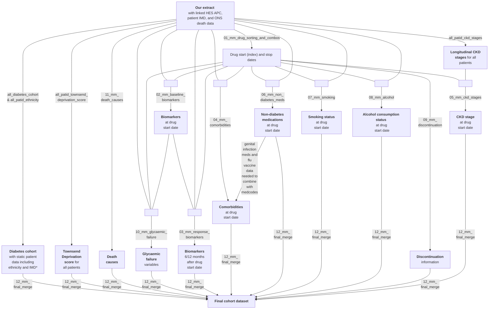

# Treatment response cohort 

The treatment response cohort consists of all those in the diabetes cohort (n=2,081,045; see [flow diagram](https://github.com/Exeter-Diabetes/CPRD-Cohort-scripts/blob/main/README.md#introduction)) who have at least one script for a glucose-lowering medication (drug classes: acarbose, DPP4-inhibitor, glinide, GIPGLP1-receptor co-agonist, GLP1-receptor agonist, metformin, SGLT2-inhibitor, sulphonylurea, thiazolidinedione, or insulin). The index date is the drug start date of the glucose-lowering medication. Patients can appear in the cohort multiple times with different drug classes or if they stop and then re-start a medication. For all of our primary analyses, scripts are processed by drug class (i.e. changes from one medication to another within the same class are ignored). Gaps of <6 months between prescriptions for the same drug class are ignored; gaps of >=6 months are treated as breaks. The final dataset contains biomarker, comorbidity, sociodemographic and medication info at drug start dates, as well as 6-/12-month biomarker response. As a secondary analysis, drugs were grouped by drug substance rather than drug class (drug substances: Acarbose, Acetohexamide, Albiglutide, Alogliptin, Canagliflozin, Chlorpropamide, Dapagliflozin, Dulaglutide, Empagliflozin, Ertugliflozin, Exenatide, Exenatide prolonged-release, Glibenclamide, Gliclazide, Glimepiride, Glipizide, Gliquidone, Glymidine, High-dose semaglutide, Insulin, Linagliptin, Liraglutide, Lixisenatide, Low-dose semaglutide, Metformin, Nateglinide, Oral semaglutide, Pioglitazone, Repaglinide, Rosiglitazone, Saxagliptin, Semaglutide dose unclear, Sitagliptin, Tirzepatide, Tolazamide, Tolbutamide, Troglitazone, Vildagliptin).

MASTERMIND (MRC APBI Stratification and Extreme Response Mechanism IN Diabetes) is a UK Medical Research Council funded (MR/N00633X/1 and MR/W003988/1) study consortium exploring stratified (precision) treatment in Type 2 diabetes. Part of this work uses the Type 2 subset of the treatment response cohort. Originally CPRD GOLD was used and processed as per [Rodgers et al. 2017](https://bmjopen.bmj.com/content/7/10/e017989). In 2020-2021 we recreated this processing pipeline in CPRD Aurum using an October 2020 extract (see (October2020-download branch)[https://github.com/Exeter-Diabetes/CPRD-Cohort-scripts/tree/Oct2020-download] of this repository). In 2024 we have run the same pipeline on a June 2024 CPRD Aurum extract, and this directory contains the scripts used to do this. Selected MASTERMIND papers can be found at the bottom of this page.

From 2024 our papers use a standard colour palette for the different Type 2 diabetes treatments:
-  `#E69F00` for SGLT2i
-  `#56B4E9` for GLP1-RA
-  `#CC79A7` for SU
-  `#0072B2` for DPP4i
-  `#D55E00` for TZD

&nbsp;

## Script overview

The below diagram shows the R scripts (in grey boxes) used to create the treatment response cohort.

\*IMD=Index of Multiple Deprivation; 'static' because we only have data from 2015 so only 1 value per patient.

The scripts shown in the above diagram (in grey boxes) can be found in this directory, except those which are common to the other cohorts (all_diabetes_cohort, all_patid_ethnicity, and all_patid_ckd_stages) which are in the upper directory of this repository.

&nbsp;

## Script details

'Drug' refers to diabetes medications unless otherwise stated, and the drug classes analysed by these scripts are acarbose, DPP4-inhibitors, glinides, GLP1 receptor agonists, metformin, SGLT2-inhibitors, sulphonylureas, thiazolidinediones, and insulin. 'Outputs' are the primary MySQL tables produced by each script. See also notes on the [aurum package](https://github.com/Exeter-Diabetes/CPRD-analysis-package) and [CPRD-Codelists respository](https://github.com/Exeter-Diabetes/CPRD-Codelists) in the upper directory of this repository ([here](https://github.com/Exeter-Diabetes/CPRD-Cohort-scripts#script-details)).

| Script description | &nbsp;&nbsp;&nbsp;&nbsp;&nbsp;&nbsp;&nbsp;&nbsp;&nbsp;&nbsp;&nbsp;&nbsp;&nbsp;&nbsp;&nbsp;&nbsp;&nbsp;&nbsp;&nbsp;&nbsp;&nbsp;&nbsp;&nbsp;&nbsp;&nbsp;&nbsp;&nbsp;&nbsp;&nbsp;&nbsp;&nbsp;&nbsp;&nbsp;&nbsp;&nbsp;&nbsp;&nbsp;&nbsp;&nbsp;&nbsp;&nbsp;&nbsp;&nbsp;&nbsp;&nbsp;&nbsp;&nbsp;&nbsp;&nbsp;&nbsp;&nbsp;&nbsp;&nbsp;&nbsp;&nbsp;&nbsp;&nbsp;&nbsp;&nbsp;&nbsp;&nbsp;Outputs&nbsp;&nbsp;&nbsp;&nbsp;&nbsp;&nbsp;&nbsp;&nbsp;&nbsp;&nbsp;&nbsp;&nbsp;&nbsp;&nbsp;&nbsp;&nbsp;&nbsp;&nbsp;&nbsp;&nbsp;&nbsp;&nbsp;&nbsp;&nbsp;&nbsp;&nbsp;&nbsp;&nbsp;&nbsp;&nbsp;&nbsp;&nbsp;&nbsp;&nbsp;&nbsp;&nbsp;&nbsp;&nbsp;&nbsp;&nbsp;&nbsp;&nbsp;&nbsp;&nbsp;&nbsp;&nbsp;&nbsp;&nbsp;&nbsp;&nbsp;&nbsp;&nbsp;&nbsp;&nbsp;&nbsp;&nbsp;&nbsp;&nbsp;&nbsp;&nbsp;&nbsp; |
| ---- | ---- |
| **all_patid_ckd_stages**: uses eGFR calculated from serum creatinine to define longitudinal CKD stages for all patids as per [our algorithm](https://github.com/Exeter-Diabetes/CPRD-Codelists#ckd-chronic-kidney-disease-stage) |  **all_patid_ckd_stages_from_algorithm**:  1 row per patid, with onset of different CKD stages in wide format |
| **all_patid_ethnicity**: uses GP and linked HES data to define ethnicity as per [our algorithm](https://github.com/Exeter-Diabetes/CPRD-Codelists#ethnicity)  | **all_patid_ethnicity**:  1 row per patid, with 5-category, 16-category and QRISK2-category ethnicity (where available) |
| **all_diabetes_cohort**: table of patids meeting the criteria for our mixed Type 1/Type 2/'other' diabetes cohort plus additional patient variables | **all_diabetes_cohort**: 1 row per patid of those in the diabetes cohort, with diabetes diagnosis dates, DOB, gender, ethnicity etc. |
| **all_patid_townsend_deprivation_score**: approximate Townsend Deprivation Scores of all patids in download | **all_patid_townsend_score**: 1 row per patid with approximate Townsend Deprivation Scores derived from Index of Multiple Deprivation scores |
| **01_mm_drug_sorting_and_combos**: processes raw diabetes medication prescriptions from the CPRD Drug Issue table, combining successive prescriptions for the same drug class/drug substance into continuous periods with start and stop dates |  **mm_ohains**: all prescriptions for diabetes medications, with duplicates for patid/date/drug substance removed, and coverage calculated. 1 row per patid/date/drug substance **mm_all_scripts_long**: as per mm_ohains but with additional variables like number of drug classes and drug substances started on that day (numstart_class and numstart_substance) **mm_all_scripts**: reshaped wide version of mm_all_scripts_long, with one row per patid/date **mm_drug_start_stop**: one row per continuous period of use of each patid/drug substance, with start and stop dates, drugline etc. **mm_combo_start_stop**: one row per continuous period of patid/drug combination, including variables like time until next drug class added or removed |
| **02_mm_baseline_biomarkers**: pulls biomarkers value at drug start dates  | **mm_full_{biomarker}\_drug_merge**: all longitudinal biomarker values merged with mm_drug_start_stop with additional variables (timetochange, timeaddrem, multi_drug_start, nextdrugchange, nextdcdate) from mm_combo_start_stop - gives 1 row per biomarker reading-drug period combination **mm_baseline_biomarkers**: as per mm_drug_start_stop, with all biomarker values at drug start date where available (including HbA1c and height) |
| **03_mm_response_biomarkers**: find biomarkers values at 6 and 12 months after drug start | **mm_response_biomarkers**: as per mm_drug_start_stop, except only first instance (drug_instance==1) included, with all biomarker values at 6 and 12 months where available (including HbA1c, not height). Response HbA1cs missing where changed diabetes meds <= 61 days before drug start (timeprevcombo<=61) |
| **04_mm_comorbidities**: finds onset of comorbidities relative to drug start dates | **mm_full_{comorbidity}\_drug_merge**: all longitudinal comorbidity code occurrences merged with mm_drug_start_stop on patid - gives 1 row per comorbidity code occurrence-drug period combination **mm_comorbidities**: as per mm_drug_start_stop, with earliest predrug code occurrence, latest predrug code occurrence, and earliest postdrug code occurrence for all comorbidities (where available). Also has whether patient had hospital admission in previous year to drug start |
| **05_mm_ckd_stages**: finds onset of CKD stages relative to drug start dates | **mm_ckd_stages**: as per mm_drug_start_stop, with baseline CKD stage at drug start date where available and post-drug CKD outcomes (onset of CKD stage 3-5, onset of CKD stage 5, composite of fall in eGFR of >=40% or CKD stage 5) where available |
| **06_mm_non_diabetes_meds**: dates of various non-diabetes medication prescriptions relative to drug start dates | **mm_non_diabetes_meds**: as per mm_drug_start_stop, with earliest predrug script, latest predrug script, and earliest postdrug script for all non-diabetes medications where available |
| **07_mm_smoking**: finds smoking status at drug start dates | **mm_smoking**: as per mm_drug_start_stop, with smoking status and QRISK2 smoking category at drug start date where available |
| **08_mm_alcohol**: finds alcohol consumption status at drug start dates | **mm_alcohol**: as per mm_drug_start_stop, with alcohol consumption status at drug start date where available |
| **09_mm_discontinuation**: defines whether drug was discontinued within 3/6 months | **mm_discontinuation**: as per mm_drug_start_stop, with discontinuation variables added |
| **10_mm_glycaemic_failure**: defines whether patinet ended up with high HbA1c(s) (range of thresholds tested) whilst on drug | **mm_glycaemic_failure**: as per mm_drug_start_stop, with glycaemic failure variables added. For Exeter Diabetes members only: [notes on considerations for analysing glycaemic/treatment failure](https://github.com/Exeter-Diabetes/CPRD_Aurum/blob/main/Mastermind/Failure%20analysis%20considerations.md). |
| **11_mm_death_causes**: adds variables on causes of death | **mm_death_causes**: 1 row per patid in ONS death data table, with primary and secondary death causes plus variables for whether CV/heart failure are primary/secondary causes |
| **12_mm_final_merge**: pulls together results from other scripts to produce final dataset for a Type 2 diabetes cohort, and an All diabetes cohort (inc Type 1 and other) | **mm_{today's date}\_t2d_1stinstance**: as per mm_drug_start_stop, but includes first instance (druginstance==1) drug periods only, and excludes those starting within 91 days of registration. Only includes patids with T2D and HES linkage. Adds in variables from other scripts (e.g. comorbidities, non-diabetes meds), and adds some additional ones. **mm_{today's date}\_t2d_all_drug_periods**: as per mm_drug_start_stop (i.e. all instances, not excluding those initiated within 91 days of registration), for patids with T2D and HES linkage (the same cohort as the mm_{today's date}\_t2d_1stinstance table). **mm_{today's date}\_all_diabetes_1stinstance**: as above for T2D but including everyone with diabetes (Type 2, Type 1, other). **mm_{today's date}\_all_diabetes_all_drug_periods**: as above for T2D but including everyone with diabetes (Type 2, Type 1, other) |

&nbsp;

## Data dictionary of variables in table produced by final_merge script

Biomarkers included: HbA1c (mmol/mol), weight (kg), height (m), BMI (kg/m2), fasting glucose (mmol/L), HDL (mmol/L), triglycerides (mmol/L), blood creatinine (umol/L), LDL (mmol/L), ALT (U/L), AST (U/L), total cholesterol (mmol/L), DBP (mmHg), SBP (mmHg), ACR (mg/mmol / g/mol), blood albumin (g/L), total bilirubin (umol/L), haematocrit (%), haemoglobin (g/L), PCR (mg/mmol / g/mol), urine albumin (mg/L), urine creatinine (mmol/L) (latter two not included separately but combined where on the same day to give 'acr_from_separate' values). NB: BMI is from BMI codes only, not calculated from weight+height.

Comorbidities included: atrial fibrillation, angina (overall and specifically unstable angina recorded in hospital), asthma, bronchiectasis, CKD stage 5/ESRD, CLD, COPD, cystic fibrosis, dementia, diabetic nephropathy, haematological cancers, heart failure, hypertension (uses primary care data only, see note in script), IHD, myocardial infarction, neuropathy, other neurological conditions, PAD, pulmonary fibrosis, pulmonary hypertension, retinopathy, (coronary artery) revascularisation, rhematoid arthritis, solid cancer, solid organ transplant, stroke, TIA, family history of premature cardiovascular disease, 'primary_hhf' (hospitalisation for HF with HF as primary cause), 'medspecific_gi' (from genital_infection codelist), 'unspecific_gi' (from genital_infection_nonspec medcodelist and definite_genital_infection_meds prodcodelist), anxiety disorders, benign prostate hyperplasia, osmotic symptoms (micturition control, volume depletion, urinary frequency), falls, lower limb fracture, DKA (hospital data only), major and minor amputations in hospital (doesn't only include primary cause), osteoporosis, mild/moderate/severe frailty, photocoagulation therapy (hospital data only) and vitreous haemorrhage (hospital data only). Also medcode-coded flu vaccination (combined with prodcode-recorded flu vaccination from 06_mm_non_diabetes_med script).

Non-diabetes medications included: blood pressure medications (different classes processed separately: ACE-inhibitors, beta-blockers, calcium channel blockers, thiazide-like diuretics, loop diuretics, potassium-sparing diuretics, ARBs), medication for genital infections (candidiasis), immunosuppressants, oral steroids, oestrogens, statins and flu vaccine.

Thresholds for glycaemic failure included: 7.5% ('7.5'), 8.5% ('8.5'), baseline HbA1c ('baseline'), and baseline HbA1c-0.5% ('baseline_0.5').

Death causes included: cardiovascular (CV) death as the primary cause or any cause, and heart failure as the primary cause or any cause.

| Variable name | Description | Notes on derivation |
| --- | --- | --- |
| patid | unique patient identifier | |
| gender | gender (1=male, 2=female) | |
| dob | date of birth | if month and date missing, 30th June used, if date but not month missing, 15th of month used, or earliest medcode in year of birth if this is earlier |
| pracid | practice ID | |
| prac_region | practice region: 1=North East, 2=North West, 3=Yorkshire And The Humber, 4=East Midlands, 5=West Midlands, 6=East of England, 7=South West, 8=South Central, 9=London, 10=South East Coast, 11 Northern Ireland, 12 Scotland, 13 Wales | |
| ethnicity_5cat | 5-category ethnicity: (0=White, 1=South Asian, 2=Black, 3=Other, 4=Mixed) | Uses [our algorithm](https://github.com/Exeter-Diabetes/CPRD-Codelists#ethnicity) (NB: use all medcodes; no date restrictions): Use most frequent category If multiple categories with same frequency, use latest one If multiple categories with same frequency and used as recently as each other, label as missing Use HES if missing/no consensus from medcodes Note that codes for 'Other Asian' are included in category 1 (South Asian) so this group may include some East/Other Asian ('Chinese' is in category 3 [Other] rather than category 1, as per the 2001 census categories. For the 2011 census, Chinese ethnicity was included in group 1 to make an 'Asian' category.)  |
| ethnicity_16cat | 16-category ethnicity: (0=missing, 1=White British, 2=White Irish, 3=Other White, 4=White and Black Caribbean, 5=White and Black African, 6=White and Asian, 7=Other Mixed, 8=Indian, 9=Pakistani, 10=Bangladeshi, 11=Other Asian, 12=Caribbean, 13=African, 14=Other Black, 15=Chinese, 16=Other) | |
| ethnicity_qrisk2 | QRISK2 ethnicity category: (1=White, 2=Indian, 3=Pakistani, 4=Bangladeshi, 5=Other Asian, 6=Black Caribbean, 7=Black African, 8=Chinese, 9=Other) | |
| imd2015_10 | English Index of Multiple Deprivation (IMD) decile (1=least deprived, 10=most deprived) | |
| tds_2011 | Townsend Deprivation Score (TDS) - made by converting IMD decile scores (median TDS for LSOAs with the same IMD decile as patient used) | See [algorithm](https://github.com/Exeter-Diabetes/CPRD-Codelists#townsend-deprivation-scores) |
| has_insulin | has a prescription for insulin ever (excluding invalid dates - before DOB / after LCD/death/deregistration) | |
| type1_code_count | number of Type 1-specific codes in records (any date) | |
| type2_code_count | number of Type 2-specific codes in records (any date) | |
| raw_dm_diag_dmcodedate | earliest diabetes medcode (including diabetes exclusion codes; excluding those with obstypeid=4 (family history) and invalid dates). 'Raw' indicates that this is before codes in the year of birth are removed for those with Type 2 diabetes | |
| raw_dm_diag_date_all | diabetes diagnosis date | earliest of raw_dm_diag_dmcodedate, dm_diag_hba1cdate, dm_diag_ohadate, and dm_diag_insdate. |
| dm_diag_dmcodedate | earliest diabetes medcode (including diabetes exclusion codes; excluding those with obstypeid=4 (family history) and invalid dates). Codes in year of birth removed for those with Type 2 diabetes | |
| dm_diag_hba1cdate | earliest HbA1c >47.5 mmol/mol (excluding invalid dates, including those with valid value and unit codes only) | |
| dm_diag_ohadate | earliest OHA prescription (excluding invalid dates) | |
| dm_diag_insdate | earliest insulin prescription (excluding invalid dates) | |
| dm_diag_date_all | diabetes diagnosis date | earliest of dm_diag_dmcodedate, dm_diag_hba1cdate, dm_diag_ohadate, and dm_diag_insdate, but set to missing if this date is within -30 to +90 days (inclusive) of registration start NB: as at-diagnosis cohort excludes those with diagnosis dates before registration start, this variable is missing and only dm_diag_age (below) is present It's worth noting that we have a number of people classified as Type 2 who appear to have been diagnosed at a young age, which is likely to be a coding error. This small proportion shouldn't affect any analysis results greatly, but might need to be considered for other analysis |
| dm_diag_date | diabetes diagnosis date for those with diagnosis at/after registration start | as per dm_diag_date_all, but also missing if dm_diag_date_all is before registration start (so is missing if earliest of dm_diag_dmcodedate, dm_diag_hba1cdate, dm_diag_ohadate, and dm_diag_insdate is before or up to 90 days (inclusive) after registration start) See above note next to dm_diag_date_all variable on young diagnosis in T2Ds |
| dm_diag_codetype | whether diagnosis date represents diabetes medcode (1), high HbA1c (2), OHA prescription (3) or insulin (4) - if multiple on same day, use lowest number | |
| dm_diag_age_all | age at diabetes diagnosis | dm_diag_date_all - dob NB: as at-diagnosis cohort excludes those with diagnosis dates before registration start, this variable is missing and only dm_diag_age (below) is present See above note next to dm_diag_date_all variable on young diagnosis in T2Ds |
| dm_diag_age | age at diabetes diagnosis for those with diagnosis at/after registration start | dm_diag_date - dob See above note next to dm_diag_date_all variable on young diagnosis in T2Ds |
| dm_diag_before_reg | whether diagnosed before registration start | |
| ins_in_1_year | whether started insulin within 1 year of diagnosis (**0 may mean no or missing**) | |
| current_oha | whether prescription for OHA (non-insulin diabetes medication) within last 6 months of data | last 6 months of data = those before LCD/death/deregistration |
| diabetes_type | diabetes type | See [algorithm](https://github.com/Exeter-Diabetes/CPRD-Codelists#diabetes-algorithms) See above note next to dm_diag_date_all variable on young diagnosis in T2Ds |
| regstartdate | registration start date | |
| gp_record_end | earliest of last collection date from practice, deregistration and 31/10/2020 (latest date in records) | |
| death_date | earliest of 'cprddeathdate' (derived by CPRD) and ONS death date | NA if no death date |
| with_hes | 1 for patients with HES linkage and n_patid_hes<=20, otherwise 0| |
| drug_class | class of drug being started | |
| dstartdate | drug class/substance start date | uses dstart_class/dstart_substance=1 - see below 'Other variables produced in 01_mm_drug_sorting_and_combos but not included in final table' |
| dstopdate_class | drug class stop date | uses dstop_class=1 - see below 'Other variables produced in 01_mm_drug_sorting_and_combos but not included in final table'. If missing, row represents a new drug substance start but not a new drug class start (substance_start_only==1) |
| drug_order | position of current drug class out of all diabetes drug classes taken in chronological order (drug classes: acarbose, DPP4i, glinides, GIPGLP1, GLP1, metformin, SGLT2i, SU, TZD, insulin) | e.g. patient takes MFN, SU, MFN, TZD in that order; drugorders = 1, 2, 3, 4 |
| drug_instance | 1st, 2nd, 3rd etc. period of taking this specific drug class | |
| drugline_all / drugline | drug line i.e. how many classes of diabetes medications (out of acarbose, DPP4i, glinides, GIPGLP1, GLP1, metformin, SGLT2i, SU, TZD, insulin) the patient has previously taken, including the current drug.  drugline_all is not missing for any drug periods. In final merge script, 'drugline' is the same as 'drugline_all' except it is set to missing if diabetes diagnosis date < registration or within the 90 days following registration start (this is the only reason why this variable would be missing) | just takes into account first instance of drug e.g. patient takes MFN, SU, MFN, TZD in that order = 1, 2, 1, 4 if multiple drug classes started on same day, use minimum drug line for both |
substance_start_only | 1 where row represents a new drug substance start but not a new drug class start | 1 where drug substance start is less than 6 months after a prescription for a different drug substance in the same class |
drug_substance | substance of drug being started | |
dstopdate_substance | drug substance stop date | uses dstop_substance=1 - see below 'Other variables produced in 01_mm_drug_sorting_and_combos but not included in final table' |
dcstopdate_class | drug combo stop date (where combo defined by drug classes) | uses dcstop_class - see below 'Other variables produced in 01_mm_drug_sorting_and_combos but not included in final table' |
drug_class_combo | combination of drug classes patient is on at that date | made by concatenating names of drug classes which patient is on at that date (from binary variables; separated by '\_') |
timetochange_class | time until changed to different drug_class_combo in days (does take into account breaks when patient is on no diabetes meds) | if last combination before end of prescriptions, or if next event is a break from all drug classes, use dcstopdate_class to calculate
timetoaddrem_class | time until another drug class added or removed in days | NA if last drug_class_combo before end of prescriptions |
timeprevcombo_class | time since started previous drug_class_combo in days | NA if no previous drug_class_combo - i.e. at start of prescriptions does not take into account breaks (i.e. if patient stops all drug classes) |
multi_drug_start_class | whether multiple drug classes started on this dstartdate | |
| Acarbose / DPP4 / Glinide / GIPGLP1 / GLP1 / MFN / SGLT2 / SU / TZD / INS | binary variable of whether patient taking that drug class on that date (regardless of whether or not prescribed on that date) | calculated using dstart_class and dstop_class vars for that particular drug class: 1 if cumsum(dstart_class)> cumsum(dstop_class) or dstart_class==1 or dstop_class==1 |
dcstopdate_substance | drug combo stop date (where combo defined by drug substances) | uses dcstop_substance - see below 'Other variables produced in 01_mm_drug_sorting_and_combos but not included in final table' |
drug_substance_combo | combination of drug substances patient is on at that date | made by concatenating names of drug substances which patient is on at that date (from binary variables; separated by '\_') |
timetochange_substance | time until changed to different drug_substance_combo in days (does take into account breaks when patient is on no diabetes meds) | if last combination before end of prescriptions, or if next event is a break from all drug substances, use dcstopdate_substance to calculate
timetoaddrem_substance | time until another drug substance added or removed in days | NA if last drug_substance_combo before end of prescriptions |  
timeprevcombo_substance | time since started previous drug_substance_combo in days | NA if no previous drug_substance_combo - i.e. at start of prescriptions does not take into account breaks (i.e. if patient stops all drug substances) |
multi_drug_start_substance | whether multiple drug substances started on this dstartdate | |
Acarbose / Acetohexamide / Albiglutide / Alogliptin / Canagliflozin / Chlorpropamide / Dapagliflozin / Dulaglutide / Empagliflozin / Ertugliflozin / Exenatide / Exenatide prolonged-release / Glibenclamide / Gliclazide /  Glimepiride / Glipizide / Gliquidone / Glymidine / High-dose semaglutide / Insulin / Linagliptin / Liraglutide / Lixisenatide / Low-dose semaglutide / Metformin / Nateglinide / Oral semaglutide / Pioglitazone / Repaglinide / Rosiglitazone / Saxagliptin / Semaglutide dose unclear / Sitagliptin / Tirzepatide / Tolazamide / Tolbutamide / Troglitazone / Vildagliptin | binary variable of whether patient taking that drug substance on that date (regardless of whether or not prescribed on that date) | calculated using dstart_substance and dstop_substance vars for that particular drug substance: 1 if cumsum(dstart_substance)> cumsum(dstop_substance) or dstart_substance==1 or dstop_substance==1. NB: only 1 Acarbose column for both drug class and drug substance |
ncurrtx | how many **major** drug classes of diabetes medication (DPP4, GIPGLP1, GLP1, INS, MFN, SGLT2, SU, TZD) patient is currently taking, not including current treatment | Missing where substance_start_only==1 |
| hba1c_fail_{threshold}_date | date of glycaemic failure | earliest of: a) two HbA1cs > threshold, b) one HbA1c > threshold and nextdrugchange=="add", and c) nextdcdate, where HbA1cs are at least 91 days after drug start date and before/on nextdcdate |
| hba1c_fail_{threshold}_reason | reason for glycaemic failure | 4 options: Fail - 2 HbA1cs >threshold; Fail - 1 HbA1cs >threshold then add drug; End of prescriptions; Change in diabetes drugs
| hba1c_fail_{threshold}_reached | whether there was a HbA1c measurement at/below the threshold prior to glycaemic failure | binary 0 or 1 depending on whether there was at least 1 HbA1c measurement at/after the baseline HbA1c (so may include HbA1cs before drug start), before or on nextdrugchangedate, and before/on hba1c_fail_{threshold}_date |
| height | height in cm | Mean of all values on/post- drug start date |
| pre{biomarker} | biomarker value at baseline | For all biomarkers including prehba1c12m but not prehba1c or prehba1c12m: pre{biomarker} is closest biomarker to dstartdate within window of -730 days (2 years before dstartdate) and +7 days (a week after dstartdate)  For prehba1c and prehba1c12m: prehba1c is closest HbA1c to dstartdate within window of -183 days (6 months before dstartdate) and +7 days (a week after dstartdate); prehba1c12m is closest HbA1c to dstartdate within window of -366 days (1 year before dstartdate) and +7 days (a week after dstartdate). prehba1c/prehba1c12m before timeprevcombo excluded (prehba1c2yrs before timeprevcombo not removed) |
| pre{biomarker}date | date of baseline biomarker | |
| pre{biomarker}drugdiff | days between dstartdate and baseline biomarker (negative: biomarker measured before drug start date) | |
| post{biomarker}6m | biomarker value at 6m post drug initiation | post{biomarker}6m: closest biomarker to dstartdate+183 days (6 months), at least 3 months (91 days) after dstartdate, before 9 months, before timetoremadd (another drug class add or removed), and before timetochange+91 days (for most drug periods, timetoremadd=timetochange, they are only different if before a break, in which case timetochange<timetoremadd as timetochange doesn't include period of break and timetoremadd does - so biomarker can be within break period, up to 91 days after stopping drug of interest).  No posthba1c6m value where changed diabetes meds <= 61 days before drug start (timeprevcombo<=61) |
| post{biomarker}6mdate | date of biomarker at 6m post drug initiation | |
| post{biomarker}6mdrugdiff | days between dstartdate and post{biomarker}6mdate | |
| post{biomarker}12m | biomarker value at 12m post drug initiation | posthba1c12m: closest biomarker to dstartdate+365 days (12 months), at least 9 months (274 days) after dstartdate, before 15 months, before timetoremadd (another drug class add or removed), and before timetochange+91 days (for most drug periods, timetoremadd=timetochange, they are only different if before a break, in which case timetochange<timetoremadd as timetochange doesn't include period of break and timetoremadd does - so biomarker can be within break period, up to 91 days after stopping drug of interest).  No posthba1c12m value where changed diabetes meds <= 61 days before drug start (timeprevcombo<=61) |
| post{biomarker}12mdate | date of biomarker at 12m post drug initiation | |
| post{biomarker}12mdrugdiff | days between dstartdate and post{biomarker}6mdate | |
| {biomarker}resp6m | post{biomarker}6m - pre{biomarker}. (NB: for HbA1c uses prehba1c, not prehba1c12m) | |
| {biomarker}resp12m | post{biomarker}12m - pre{biomarker}. (NB: for HbA1c uses prehba1c, not prehba1c12m) | |
| next_egfr_date | date of first eGFR post-baseline | |
| egfr_40_decline_date | date at which eGFR<=60% of baseline value (i.e. a decline of >=40%) | |
| preckdstagedate | date of onset of baseline CKD stage (earliest test for this stage) | |
| preckdstagedrugdiff | days between dstartdate and preckdstagedate | |
| preckdstage | CKD stage at baseline | CKD stages calculated as per [our algorithm](https://github.com/Exeter-Diabetes/CPRD-Codelists#ckd-chronic-kidney-disease-stage) eGFR calculated from creatinine using CKD-EPI creatinine 2021 equation Start date = earliest test for CKD stage, only including those confirmed by another test at least 91 days later, without a test for a different stage in the intervening period Baseline stage = maximum stage with start date < dru start date or up to 7 days afterwards CKD5 supplemented by medcodes/ICD10/OPCS4 codes for CKD5 / ESRD |
| postckdstage5date | date of onset of CKD stage 5 if occurs post-drug start (more than 7 days after drug start as baseline goes up to 7 days after drug start) | |
| postckdstage345date | date of onset of CKD stage 3a-5 if occurs post-drug start (more than 7 days after drug start as baseline goes up to 7 days after drug start) | |
| predrug_earliest_{comorbidity} | earliest occurrence of comorbidity before/at dstartdate | |
| predrug_latest_{comorbidity} | latest occurrence of comorbidity before/at dstartdate | |
| postdrug_first_{comorbidity}\_hes_icd10_only | earliest occurrence of comorbidity after (not at) dstartdate, from HES (secondary care) ICD10 (diagnosis) codes only | not present for unspecific_gi, fluvacc or amputation comorbidities |
| postdrug_first_{comorbidity}\_hes_opcs4_only | earliest occurrence of comorbidity after (not at) dstartdate, from HES (secondary care) OPCS4 (operation) codes only |  not present for unspecific_gi, fluvacc or amputation comorbidities  |
| postdrug_first_{comorbidity}\_gp_only | earliest occurrence of comorbidity after (not at) dstartdate, from GP (primary care) codes only |  not present for unspecific_gi, fluvacc or amputation comorbidities  |
| postdrug_first_{comorbidity} | earliest occurrence of comorbidity after (not at) dstartdate | |
| predrug_{comorbidity} | binary 0/1 if any instance of comorbidity before/at dstartdate | |
| fh_diabetes | binary 0/1 for whether family history of diabetes reported before/at dstartdate | If patient has codes for both positive and negative family history: most recent before/at dstartdate used; if both on same day classed as missing) |
| hosp_admission_prev_year | 1 if patient has 1 or more hospital admision in the previous year to drug start (not including dstartdate). NA if no admissions or if HES data not available - changed to 0 if no admissions and HES data available in final merge script | |
| hosp_admission_prev_year_count | Number of hospital admissions in the previous year to drug start (not including dstartdate). NA if no admissions or if HES data not available - changed to 0 if no admissions and HES data available in final merge script | |
| postdrug_first_emergency_hosp | earliest inpatient hospital admission after (not at) dstartdate - any cause; emergency only (excluding admimeth=11, 12, or 13) | |
| postdrug_first_emergency_hosp_cause | primary cause of admission (ICD10 code) for earliest emergency inpatient hospital admission (date of admission in postdrug_first_emergency_hosp variable) | |
| predrug_earliest_{med} | earliest script for non-diabetes medication before/at dstartdate | |
| predrug_latest_{med} | latest script for non-diabetes medication before/at dstartdate | |
| postdrug_first_{med} | earliest script for non-diabetes medication after (not at) dstartdate | |
| smoking_cat | Smoking category at drug start: Non-smoker, Ex-smoker or Active smoker | Derived from [our algorithm](https://github.com/Exeter-Diabetes/CPRD-Codelists#smoking) |
| qrisk2_smoking_cat | QRISK2 smoking category code (0-4) | |
| qrisk2_smoking_cat_uncoded | Decoded version of qrisk2_smoking_cat: 0=Non-smoker, 1= Ex-smoker, 2=Light smoker, 3=Moderate smoker, 4=Heavy smoker | |
| alcohol_cat | Alcohol consumption category at drug start: None, Within limits, Excess or Heavy | Derived from [our algorithm](https://github.com/Exeter-Diabetes/CPRD-Codelists#alcohol) |
| ttc3m | 1 if timeondrug<=3 months | |
| ttc6m | 1 if timeondrug<=6 months (may also be <=3 months) | |
| ttc12m | 1 if timeondrug<=12 months (may also be <=6 months/3 months) | |
| stopdrug_3m_3mFU | 1 if discontinue within 3 months and have at least 3 months followup after discontinuation (before last prescription ever) to confirm this. 0 if don't discontinue at 3 months | These variables are missing if the person does discontinue in the time stated, but does not have the followup time stated to confirm this |
| stopdrug_3m_6mFU | 1 if discontinue within 3 months and have at least 6 months followup to confirm this 0 if don't discontinue at 3 months | |
| stopdrug_6m_3mFU | 1 if discontinue within 6 months and have at least 3 months followup to confirm this 0 if don't discontinue at 6 months | |
| stopdrug_6m_6mFU | 1 if discontinue within 6 months and have at least 6 months followup to confirm this 0 if don't discontinue at 6 months | |
| stopdrug_12m_3mFU | 1 if discontinue within 12 months and have at least 3 months followup to confirm this 0 if don't discontinue at 12 months | |
| stopdrug_12m_6mFU | 1 if discontinue within 12 months and have at least 6 months followup to confirm this 0 if don't discontinue at 12 months | |
| stopdrug_3m_3mFU_MFN_hist | History of metformin discontinuation: NA for all MFN drug periods. For other drugs: number of instances of MFN discontinued prior to current drug period (using stopdrug_3m_3m_FU), where MFN dstopdate (last prescription) was earlier or on the same day as current dstartdate. NA if no prior MFN periods/all prior MFN periods have missing stopdrug_3m_3m_FU. | |
| stopdrug_3m_6mFU_MFN_hist | History of metformin discontinuation: NA for all MFN drug periods. For other drugs: number of instances of MFN discontinued prior to current drug period (using stopdrug_3m_6mFU), where MFN dstopdate (last prescription) was earlier or on the same day as current dstartdate. NA if no prior MFN periods/all prior MFN periods have missing stopdrug_3m_6mFU. | |
| stopdrug_6m_3mFU_MFN_hist | History of metformin discontinuation: NA for all MFN drug periods. For other drugs: number of instances of MFN discontinued prior to current drug period (using stopdrug_6m_3mFU), where MFN dstopdate (last prescription) was earlier or on the same day as current dstartdate. NA if no prior MFN periods/all prior MFN periods have missing stopdrug_6m_3mFU. | |
| stopdrug_6m_6mFU_MFN_hist | History of metformin discontinuation: NA for all MFN drug periods. For other drugs: number of instances of MFN discontinued prior to current drug period (using stopdrug_6m_6mFU), where MFN dstopdate (last prescription) was earlier or on the same day as current dstartdate. NA if no prior MFN periods/all prior MFN periods have missing stopdrug_6m_6mFU. | |
| stopdrug_12m_3mFU_MFN_hist | History of metformin discontinuation: NA for all MFN drug periods. For other drugs: number of instances of MFN discontinued prior to current drug period (using stopdrug_12m_3mFU_MFN), where MFN dstopdate (last prescription) was earlier or on the same day as current dstartdate. NA if no prior MFN periods/all prior MFN periods have missing stopdrug_12m_3mFU_MFN. | |
| stopdrug_12m_6mFU_MFN_hist | History of metformin discontinuation: NA for all MFN drug periods. For other drugs: number of instances of MFN discontinued prior to current drug period (using stopdrug_12m_6mFU), where MFN dstopdate (last prescription) was earlier or on the same day as current dstartdate. NA if no prior MFN periods/all prior MFN periods have missing stopdrug_12m_6mFU. | |
| primary_death_cause | primary death cause from ONS data (ICD10; 'cause' in ONS death table) |
| secondary_death_cause1-15 | secondary death cases from ONS data (ICD10; 'cause1'-'cause15' in ONS death table) |
| cv_death_primary_cause | 1 if primary cause of death is CV |
| cv_death_any_cause | 1 if any (primary or secondary) cause of death is CV |
| hf_death_primary_cause | 1 if primary cause of death is heart failure |
| hf_death_any_cause | 1 if any (primary or secondary) cause of death is heartfailure |
| dstartdate_age | age of patient at dstartdate in years | dstartdate - dob |
| dstartdate_dm_dur_all | diabetes duration at dstartdate in years | dstartdate - dm_diag_date_all Missing if dm_diag_date_all is missing i.e. if diagnosis date is within -30 to +90 days (inclusive) of registration start |
| dstartdate_dm_dur | diabetes duration at dstartdate in years | dstartdate-dm_diag_date Missing if dm_diag_date is missing; dm_diag_date is missing if dm_diag_date_all is missing (as per above: if diagnosis date is within -30 to +90 days (inclusive) of registration start) or additionally if diagnosis date is before registration |
| qdiabeteshf_5yr_score | 5-year QDiabetes-heart failure score (in %) Missing for anyone with age/BMI/biomarkers outside of range for model (or missing HbA1c, ethnicity or smoking info) NB: NOT missing if have pre-existing HF but obviously not valid | prehba1c2yrs used |
| qdiabeteshf_lin_predictor | QDiabetes heart failure linear predictor Missing for anyone with age/BMI/biomarkers outside of range for model (or missing HbA1c, ethnicity or smoking info) NB: NOT missing if have pre-existing HF but obviously not valid | prehba1c2yrs used |
| qrisk2_5yr_score | 5-year QRISK2-2017 score (in %) Missing for anyone with age/BMI/biomarkers outside of range for model (or missing ethnicity or smoking info) NB: NOT missing if have CVD but obviously not valid |
| qrisk2_10yr_score | 10-year QRISK2-2017 score (in %) Missing for anyone with age/BMI/biomarkers outside of range for model (or missing ethnicity or smoking info) NB: NOT missing if have CVD but obviously not valid |
| qrisk2_lin_predictor | QRISK2-2017 linear predictor NB: NOT missing if have CVD but obviously not valid Missing for anyone with age/BMI/biomarkers outside of range for model (or missing ethnicity or smoking info) |
| ckdpc_egfr60_total_score (_complete_acr) | CKDPC risk score for 5-year risk of eGFR<=60ml/min/1.73m2 in people with diabetes (total events). '_complete_acr' suffix means missing urinary ACR values substituted with 10 mg/g as per the development paper for this model. Missing for anyone with CKD stage 3a-5 (not if CKD stage missing) or eGFR<60ml/min/1.73m2 at drug start, with age/BMI outside of range for model (20-80 years, 20 kg/m2+), or missing any predictors (ethnicity, eGFR, HbA1c, smoking info, BMI or urinary ACR [latter - doesn't affect '_complete_acr' variables]) | prehba1c2yrs used |
| ckdpc_egfr60_total_lin_predictor (_complete_acr) | Linear predictor for CKDPC risk score for eGFR<=60ml/min/1.73m2 in people with diabetes (total events). '_complete_acr' suffix means missing urinary ACR values substituted with 10 mg/g as per the development paper for this model. Missing for anyone with CKD stage 3a-5 (not if CKD stage missing) or eGFR<60ml/min/1.73m2 at drug start, with age/BMI outside of range for model (20-80 years, 20 kg/m2+), or missing any predictors (ethnicity, eGFR, HbA1c, smoking info, BMI or urinary ACR [latter - doesn't affect '_complete_acr' variables]) | prehba1c2yrs used |
| ckdpc_egfr60_confirmed_score (_complete_acr) | CKDPC risk score for 5-year risk of eGFR<=60ml/min/1.73m2 in people with diabetes (confirmed events only). '_complete_acr' suffix means missing urinary ACR values substituted with 10 mg/g as per the development paper for this model. Missing for anyone with CKD stage 3a-5 (not if CKD stage missing) or eGFR<60ml/min/1.73m2 at drug start, with age/BMI outside of range for model (20-80 years, 20 kg/m2+), or missing any predictors (ethnicity, eGFR, HbA1c, smoking info, BMI or urinary ACR [latter - doesn't affect '_complete_acr' variables]) | prehba1c2yrs used |
| ckdpc_egfr60_confirmed_lin_predictor (_complete_acr) | Linear predictor for CKDPC risk score for eGFR<=60ml/min/1.73m2 in people with diabetes (confirmed events). '_complete_acr' suffix means missing urinary ACR values substituted with 10 mg/g as per the development paper for this model. Missing for anyone with CKD stage 3a-5 (not if CKD stage missing) or eGFR<60ml/min/1.73m2 at drug start, with age/BMI outside of range for model (20-80 years, 20 kg/m2+), or missing any predictors (ethnicity, eGFR, HbA1c, smoking info, BMI or urinary ACR [latter - doesn't affect '_complete_acr' variables]) | prehba1c2yrs used |
| ckdpc_40egfr_score | CKDPC risk score for 3-year risk of 40% decline in eGFR or kidney failure in people with diabetes and baseline eGFR>=60ml/min/1.73m2. Missing for anyone with CKD stage 3a-5 (not if CKD stage missing) or eGFR<60ml/min/1.73m2 at drug start, with age/BMI outside of range for model (20-80 years, 20 kg/m2+), or missing any predictors (eGFR, HbA1c, smoking info, SBP, BMI or urinary ACR) | prehba1c2yrs used |
| ckdpc_40egfr_lin_predictor | Linear predictor for CKDPC risk score for 40% decline in eGFR or kidney failure in people with diabetes and baseline eGFR>=60ml/min/1.73m2.  Missing for anyone with CKD stage 3a-5 (not if CKD stage missing) or eGFR<60ml/min/1.73m2 at drug start, with age/BMI outside of range for model (20-80 years, 20 kg/m2+), or missing any predictors (eGFR, HbA1c, smoking info, SBP, BMI or urinary ACR) | prehba1c2yrs used |

&nbsp;

### Other variables produced in 01_mm_drug_sorting_and_combos but not included in final table

| Variable name | Description | Notes on derivation |
| --- | --- | --- |
| quantity | number of tablets/items in prescriptions | provided by CPRD in drug issue table, directly from GP records if 0, assume missing if multiple prescriptions for same patid/date/drug, take mean |
| daily_dose | number of tablets/items prescribed per day | provided by CPRD (in dosage lookup ('common doses') - need to merge with dosageid in Drug Issue table), 'derived using CPRD algorithm based on free text' if 0, assume missing if multiple prescriptions for same patid/date/drug, take mean |
| duration | number of days prescription is for | provided by CPRD in drug issue table, no info on source so presumably from GP records if 0, assume missing if multiple prescriptions for same patid/date/drug, take mean |
| coverage | days of meds for that script | quantity/daily_dose if neither are missing, or use duration NB: very high missingness in Aurum (~60%) |
| drugsubstances | drug substances within that class prescribed on that date | from [drug substance class lookup](https://github.com/Exeter-Diabetes/CPRD-Katie-MASTERMIND-Scripts/blob/main/Scripts/drug_substance_class_lookup.txt) if multiple prescriptions for same patid/date/drug with different drug substances, combined using ' & ' as a separator |
| dstart | whether date is start date for that drug class (binary 0 or 1) | dstart=1 if it is the earliest script of that drug class for that person, or if previous script was >183 days (6 months) prior |
| dstop | whether date is stop for that drug class (binary 0 or 1) | dstop=1 if it is the last script of that drug class for that person, or if next script is >183 days (6 months) after |
| numpxdate | number of different drug classes prescribed that day (duplicated within patid/date) | |
| numstart | number of drug classes started on that day (duplicated within patid/date) | sum of dstart on that day |
| numstop | number of drug classes stopped on that day (duplicated within patid/date) | sum of dstop on that day |
| cu_numstart | cumulative sum of numstart up to this date | |
| cu_numstop | cumulative sum of numstop up to this date | |
| dcstart | whether date is start date for drug combo | uses drugcombo variable: 1 if it is the earliest instance of that drug combo for that person, or if previous script was >183 days (6 months) prior |
| dcstop | whether date is stop for drug combo | uses drugcombo variable: 1 if it is the last instance of that drug combo for that person, or if next script is >183 days (6 months) after |
| timetolastpx | time from date to last prescription date for patient (in days) | |

&nbsp;

## Selected MASTERMIND papers
### From CPRD GOLD dataset
* [Precision Medicine in Type 2 Diabetes: Clinical Markers of Insulin Resistance Are Associated With Altered Short- and Long-term Glycemic Response to DPP-4 Inhibitor Therapy](https://diabetesjournals.org/care/article/41/4/705/36908/Precision-Medicine-in-Type-2-Diabetes-Clinical) Dennis et al. 2018
* [Sex and BMI Alter the Benefits and Risks of Sulfonylureas and Thiazolidinediones in Type 2 Diabetes: A Framework for Evaluating Stratification Using Routine Clinical and Individual Trial Data](https://diabetesjournals.org/care/article/41/9/1844/40749/Sex-and-BMI-Alter-the-Benefits-and-Risks-of) Dennis et al. 2018
* [Time trends and geographical variation in prescribing of drugs for diabetes in England from 1998 to 2017](https://dom-pubs.onlinelibrary.wiley.com/doi/full/10.1111/dom.13346) Curtis et al. 2018
* [What to do with diabetes therapies when HbA1c lowering is inadequate: add, switch, or continue? A MASTERMIND study](https://bmcmedicine.biomedcentral.com/articles/10.1186/s12916-019-1307-8) McGovern et al. 2019
* [Time trends in prescribing of type 2 diabetes drugs, glycaemic response and risk factors: A retrospective analysis of primary care data, 20102017](https://dom-pubs.onlinelibrary.wiley.com/doi/10.1111/dom.13687) Dennis et al. 2019
* [Prior event rate ratio adjustment produced estimates consistent with randomized trial: a diabetes case study](https://www.jclinepi.com/article/S0895-4356(19)30114-3/fulltext) Rodgers et. al 2020
* [Risk factors for genital infections in people initiating SGLT2 inhibitors and their impact on discontinuation](https://drc.bmj.com/content/8/1/e001238.long) McGovern et al. 2020
* [Development of a treatment selection algorithm for SGLT2 and DPP-4 inhibitor therapies in people with type 2 diabetes: a retrospective cohort study](https://www.thelancet.com/journals/landig/article/PIIS2589-7500(22)00174-1/fulltext) Dennis et al. 2022
* [Dirichlet process mixture models to impute missing predictor data in counterfactual prediction models: an application to predict optimal type 2 diabetes therapy](https://bmcmedinformdecismak.biomedcentral.com/articles/10.1186/s12911-023-02400-3) Cardoso et al. 2024

### From October 2020 CPRD Aurum dataset
* [Recent UK type 2 diabetes treatment guidance represents a near whole population indication for SGLT2-inhibitor therapy](https://cardiab.biomedcentral.com/articles/10.1186/s12933-023-02032-x) Young et al. 2023*
* [Phenotype-based targeted treatment of SGLT2 inhibitors and GLP-1 receptor agonists in type 2 diabetes](https://link.springer.com/article/10.1007/s00125-024-06099-3) Cardoso et al. 2024
* [Safety and effectiveness of SGLT2 inhibitors in a UK population with type 2 diabetes and aged over 70 years: an instrumental variable approach](https://link.springer.com/article/10.1007/s00125-024-06190-9) Guedemann et al. 2024
