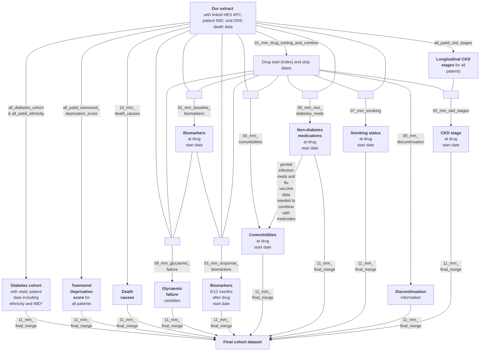

# BP Treatment response cohort

The treatment response cohort consists of all those in the diabetes cohort (n=1,138,179; see [flow diagram](https://github.com/Exeter-Diabetes/CPRD-Cohort-scripts/blob/main/README.md#introduction)) who have at least one script for a blood-pressure medication (drug classes: angiotensin-converting enzyme inhibitor [ACE], angiotensin-receptor blocker [ARB], thiazide, calcium channel blocker [CCB]). The index date is the drug start date of the blood-pressure medication. Patients can appear in the cohort multiple times with different drug classes or if they stop and then re-start a medication. Scripts are processed by drug class (i.e. changes from one medication to another within the same class are ignored. Gaps of \<3 months between prescriptions for the same drug class are ignored; gaps of \>=3 months are treated as breaks (this has been repeated for 6-months. The final dataset contains biomarker, comorbidity, sociodemographic and medication info at drug start dates, as well as **3-/6-/12-month** biomarker response.

Two datasets were created: one using a gap of \<3 months between prescriptions (XX.01) and one using a gap of \<6 months between prescriptions (XX.02).

&nbsp;

## Script overview

The below diagram shows the R scripts (in grey boxes) used to create the treatment response cohort.

\*IMD=Index of Multiple Deprivation; 'static' because we only have data from 2015 so only 1 value per patient.

The scripts shown in the above diagram (in grey boxes) can be found in this directory, except those which are common to the other cohorts (all_diabetes_cohort, all_patid_ethnicity, and all_patid_ckd_stages) which are in the upper directory of this repository.

&nbsp;

## Script details

'Drug' refers to blood pressure medications unless otherwise stated, and the drug classes analysed by these scripts are ACE-inhibitors, calcium channel blockers, thiazide-like diuretics, and ARBs. 'Outputs' are the primary MySQL tables produced by each script. See also notes on the [aurum package](https://github.com/Exeter-Diabetes/CPRD-analysis-package) and [CPRD-Codelists respository](https://github.com/Exeter-Diabetes/CPRD-Codelists) in the upper directory of this repository ([here](https://github.com/Exeter-Diabetes/CPRD-Cohort-scripts#script-details)).

Comorbidities included: atrial fibrillation, angina (overall and specifically unstable angina recorded in hospital), asthma, bronchiectasis, CKD stage 5/ESRD, CLD, COPD, cystic fibrosis, dementia, diabetic nephropathy, haematological cancers, heart failure, hypertension (uses primary care data only, see note in script), IHD, myocardial infarction, neuropathy, other neurological conditions, PAD, pulmonary fibrosis, pulmonary hypertension, retinopathy, (coronary artery) revascularisation, rhematoid arthritis, solid cancer, solid organ transplant, stroke, TIA, family history of premature cardiovascular disease, 'primary_hhf' (hospitalisation for HF with HF as primary cause), 'medspecific_gi' (from genital_infection codelist), 'unspecific_gi' (from genital_infection_nonspec medcodelist and definite_genital_infection_meds prodcodelist), anxiety disorders, benign prostate hyperplasia, osmotic symptoms (micturition control, volume depletion, urinary frequency), falls, lower limb fracture, DKA (hospital data only), major and minor amputations in hospital (doesn't only inlcude primary cause), osteoporosis, mild/moderate/severe frailty. Also medcode-coded flu vaccination (combined with prodcode-recorded flu vaccination from 06_mm_non_diabetes_med script).

Non-diabetes medications included: blood pressure medications (different classes processed separately: ACE-inhibitors, beta-blockers, calcium channel blockers, thiazide-like diuretics, loop diuretics, potassium-sparing diuretics, ARBs), medication for genital infections (candidiasis), immunosuppressants, oral steroids, oestrogens, statins and flu vaccine.

Death causes included: cardiovascular (CV) death as the primary cause or any cause, and heart failure as the primary cause or any cause.

&nbsp;

### Other variables produced in 01_mm_drug_sorting_and_combos but not included in final table

| Variable name | Description | Notes on derivation |
| --- | --- | --- |
| quantity | number of tablets/items in prescriptions | provided by CPRD in drug issue table, directly from GP records if 0, assume missing if multiple prescriptions for same patid/date/drug, take mean |
| daily_dose | number of tablets/items prescribed per day | provided by CPRD (in dosage lookup ('common doses') - need to merge with dosageid in Drug Issue table), 'derived using CPRD algorithm based on free text' if 0, assume missing if multiple prescriptions for same patid/date/drug, take mean |
| duration | number of days prescription is for | provided by CPRD in drug issue table, no info on source so presumably from GP records if 0, assume missing if multiple prescriptions for same patid/date/drug, take mean |
| coverage | days of meds for that script | quantity/daily_dose if neither are missing, or use duration NB: very high missingness in Aurum (~60%) |
| drugsubstances | drug substances within that class prescribed on that date | from [drug substance class lookup](https://github.com/Exeter-Diabetes/CPRD-Katie-MASTERMIND-Scripts/blob/main/Scripts/drug_substance_class_lookup.txt) if multiple prescriptions for same patid/date/drug with different drug substances, combined using ' & ' as a separator |
| dstart | whether date is start date for that drug class (binary 0 or 1) | dstart=1 if it is the earliest script of that drug class for that person, or if previous script was >183 days (6 months) prior |
| dstop | whether date is stop for that drug class (binary 0 or 1) | dstop=1 if it is the last script of that drug class for that person, or if next script is >183 days (6 months) after |
| numpxdate | number of different drug classes prescribed that day (duplicated within patid/date) | |
| numstart | number of drug classes started on that day (duplicated within patid/date) | sum of dstart on that day |
| numstop | number of drug classes stopped on that day (duplicated within patid/date) | sum of dstop on that day |
| cu_numstart | cumulative sum of numstart up to this date | |
| cu_numstop | cumulative sum of numstop up to this date | |
| dcstart | whether date is start date for drug combo | uses drugcombo variable: 1 if it is the earliest instance of that drug combo for that person, or if previous script was >183 days (6 months) prior |
| dcstop | whether date is stop for drug combo | uses drugcombo variable: 1 if it is the last instance of that drug combo for that person, or if next script is >183 days (6 months) after |
| timetolastpx | time from date to last prescription date for patient (in days) | |

&nbsp;

## Previous MASTERMIND papers (from GOLD dataset)
* [Precision Medicine in Type 2 Diabetes: Clinical Markers of Insulin Resistance Are Associated With Altered Short- and Long-term Glycemic Response to DPP-4 Inhibitor Therapy](https://diabetesjournals.org/care/article/41/4/705/36908/Precision-Medicine-in-Type-2-Diabetes-Clinical) Dennis et al. 2018
* [Sex and BMI Alter the Benefits and Risks of Sulfonylureas and Thiazolidinediones in Type 2 Diabetes: A Framework for Evaluating Stratification Using Routine Clinical and Individual Trial Data](https://diabetesjournals.org/care/article/41/9/1844/40749/Sex-and-BMI-Alter-the-Benefits-and-Risks-of) Dennis et al. 2018
* [Time trends and geographical variation in prescribing of drugs for diabetes in England from 1998 to 2017](https://dom-pubs.onlinelibrary.wiley.com/doi/full/10.1111/dom.13346) Curtis et al. 2018
* [What to do with diabetes therapies when HbA1c lowering is inadequate: add, switch, or continue? A MASTERMIND study](https://bmcmedicine.biomedcentral.com/articles/10.1186/s12916-019-1307-8) McGovern et al. 2019
* [Time trends in prescribing of type 2 diabetes drugs, glycaemic response and risk factors: A retrospective analysis of primary care data, 2010–2017](https://dom-pubs.onlinelibrary.wiley.com/doi/10.1111/dom.13687) Dennis et al. 2019
* [Prior event rate ratio adjustment produced estimates consistent with randomized trial: a diabetes case study](https://www.jclinepi.com/article/S0895-4356(19)30114-3/fulltext) Rodgers et. al 2020
* [Risk factors for genital infections in people initiating SGLT2 inhibitors and their impact on discontinuation](https://drc.bmj.com/content/8/1/e001238.long) McGovern et al. 2020
* [Development of a treatment selection algorithm for SGLT2 and DPP-4 inhibitor therapies in people with type 2 diabetes: a retrospective cohort study](https://www.thelancet.com/journals/landig/article/PIIS2589-7500(22)00174-1/fulltext) Dennis et al. 2022
