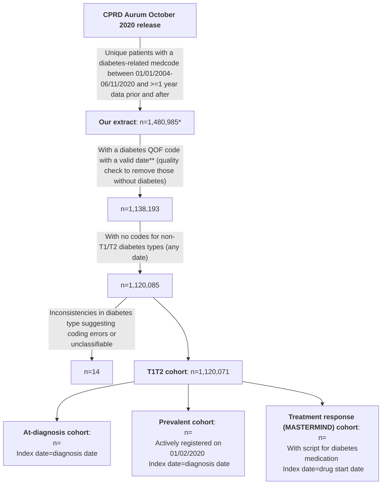
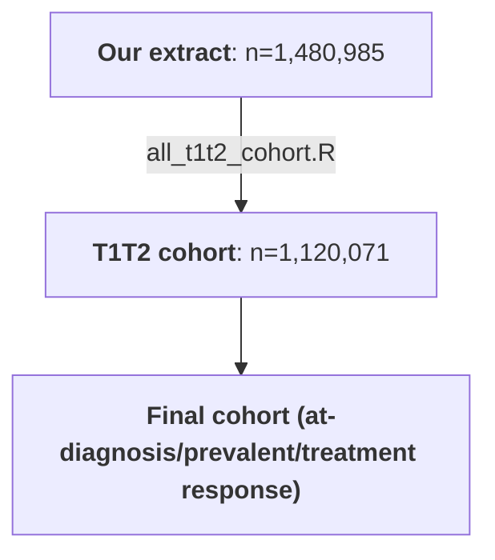

# CPRD Aurum Cohort scripts

## Introduction

This repository contains the scripts used by the Exeter Diabetes team to produce three cohorts and their associated biomarker/comorbidity/sociodemographic/medication data from a CPRD Aurum dataset: 
* An **'at-diagnosis'** cohort
* A **prevalent** cohort (registered at 01/02/2020)
* A **treatment response** (MASTERMIND) cohort (those initiating diabetes medications)

The below diagram outlines the data processing steps involved in creating these cohorts.

\* Extract actually contained n=1,481,294 unique patients (1,481,884 in total but some duplicates) but included n=309 with registration start dates in 2020 (which did not fulfil the extract criteria of having a diabetes-related medcode between 01/01/2004-06/11/2020 and >=1 year of data after this; some of these were also not 'acceptable' by [CPRD's definition](https://cprd.com/sites/default/files/2023-02/CPRD%20Aurum%20Glossary%20Terms%20v2.pdf)). See next section for further details on the extract.
&nbsp;

\** A valid date is an obsdate (for medcodes) which is no earlier than the patient's date of birth (no earlier than the month of birth if date of birth is not available; no earlier than full date of birth if this is available), no later than the patient's date of death (earliest of cprd_ddeath (Patient table) and dod/dor where dod not available (ONS death data)) where this is present, no later than deregistration where this is present, and no later than the last collection date from the Practice.

&nbsp;

## Extract details
Patients with a diabetes-related medcode ([full list here](https://github.com/Exeter-Diabetes/CPRD-Katie-MASTERMIND-Scripts/blob/main/Extract-details/diab_med_codes_2020.txt)) in the Observation table were extracted from the October 2020 CPRD Aurum release. See below for full inclusion criteria:

&nbsp;

&nbsp;

## Script overview

'Drug' refers to diabetes medications unless otherwise stated, and the drug classes analysed by these scripts are acarbose, DPP4-inhibitors, glinides, GLP1 receptor agonists, metformin, SGLT2-inhibitors, sulphonylureas, thiazolidinediones, and insulin. 'Outputs' are the primary MySQL tables produced by each script. Various scripts link to our [CPRD-Codelists repository](https://github.com/Exeter-Diabetes/CPRD-Codelists) which contains more details on the algorithms used to define variables such as ethnicity and diabetes type - see individual scripts for links to the appropriate part of the CPRD-Codelists repository. The variables in each of the output tables and their definitions are listed in the [Data Dictionary]().

&nbsp;

Each cohort includes biomarker measurements, comorbidity status and lifestyle status (smoking/alcohol) at baseline (index date). Template scripts which pull out these variables relative to an index date can be found in this directory ('template_baseline_biomarker', 'template_comorbidities', 'template_smoking', and 'template_alcohol'; see below for details).

These were tailored for each of the three cohorts and the tailored scripts can be found in the individual 'At-diagnosis', 'Prevalent' and 'Treatment response' directories. These directories include additional scripts e.g. the treatment response cohort also has biomarker responses (6/12 month post-index) and post-index comorbidity occurrences, used to evaluate treatment response.

SOMETHING ABOUT SCRIPT ORDER and final merge being last. And that all_t1t2 and ethnicity  (and CKD stage) scripts use data from all time even if after index date to determine diabetes type / ethnicity / CKD stage.

| Script description | &nbsp;&nbsp;&nbsp;&nbsp;&nbsp;&nbsp;&nbsp;&nbsp;&nbsp;&nbsp;&nbsp;&nbsp;&nbsp;&nbsp;&nbsp;&nbsp;&nbsp;&nbsp;&nbsp;&nbsp;&nbsp;&nbsp;&nbsp;&nbsp;&nbsp;&nbsp;&nbsp;&nbsp;&nbsp;&nbsp;&nbsp;&nbsp;&nbsp;&nbsp;&nbsp;&nbsp;&nbsp;&nbsp;&nbsp;&nbsp;&nbsp;&nbsp;&nbsp;&nbsp;&nbsp;&nbsp;&nbsp;&nbsp;&nbsp;&nbsp;&nbsp;&nbsp;&nbsp;&nbsp;&nbsp;&nbsp;&nbsp;&nbsp;&nbsp;&nbsp;&nbsp;Outputs&nbsp;&nbsp;&nbsp;&nbsp;&nbsp;&nbsp;&nbsp;&nbsp;&nbsp;&nbsp;&nbsp;&nbsp;&nbsp;&nbsp;&nbsp;&nbsp;&nbsp;&nbsp;&nbsp;&nbsp;&nbsp;&nbsp;&nbsp;&nbsp;&nbsp;&nbsp;&nbsp;&nbsp;&nbsp;&nbsp;&nbsp;&nbsp;&nbsp;&nbsp;&nbsp;&nbsp;&nbsp;&nbsp;&nbsp;&nbsp;&nbsp;&nbsp;&nbsp;&nbsp;&nbsp;&nbsp;&nbsp;&nbsp;&nbsp;&nbsp;&nbsp;&nbsp;&nbsp;&nbsp;&nbsp;&nbsp;&nbsp;&nbsp;&nbsp;&nbsp;&nbsp; |
| ---- | ---- |
| **01_mm_drug_sorting_and_combos**: processes raw diabetes medication prescriptions from the CPRD Drug Issue table, combining successive prescriptions for the same drug class into continuous periods with start and stop dates |  **mm_ohains**: all prescriptions for diabetes medications, with duplicates for patid/date/drugclass removed, and coverage calculated. 1 row per patid/date/drugclass **mm_all_scripts_long**: as per mm_ohains but with additional variables like number of drug classes started on that day (numstart) **mm_all_scripts**: reshaped wide version of mm_all_scripts_long, with one row per patid/date **mm_drug_start_stop**: one row per continuous period of use of each patid/drugclass, with start and stop dates, drugline etc. **mm_combo_start_stop**: one row per continuous period of patid/drug combination, including variables like time until next drug class added or removed |
| **02_mm_baseline_biomarkers**: pulls biomarkers value at drug start dates  | **mm_full_{biomarker}\_drug_merge**: all longitudinal biomarker values merged with mm_drug_start_stop with additional variables (timetochange, timeaddrem, multi_drug_start) from mm_combo_start_stop - gives 1 row per biomarker reading-drug period combination **mm_baseline_biomarkers**: as per mm_drug_start_stop, with all biomarker values at drug start date where available (including HbA1c and height) |
| **03_mm_response_biomarkers**: find biomarkers values at 6 and 12 months after drug start | **mm_response_biomarkers**: as per mm_drug_start_stop, except only first instance (drug_instance==1) included, with all biomarker values at 6 and 12 months where available (including HbA1c, not height). Response HbA1cs missing where changed diabetes meds <= 61 days before drug start (timeprevcombo<=61) |
| **04_mm_comorbidities**: finds onset of comorbidities relative to drug start dates | **mm_full_{comorbidity}\_drug_merge**: all longitudinal comorbidity code occurrences merged with mm_drug_start_stop on patid - gives 1 row per comorbidity code occurrence-drug period combination **mm_comorbidities**: as per mm_drug_start_stop, with earliest predrug code occurrence, latest predrug code occurrence, and earliest postdrug code occurrence for all comorbidities (where available). Also has whether patient had hospital admission in previous year to drug start |
| **05_mm_ckd_stages**: finds onset of CKD stages relative to drug start dates | **all_patid_ckd_stages_from_algorithm**: 1 row per patid, with onset of different CKD stages in wide format **mm_ckd_stages**: as per mm_drug_start_stop, with baseline CKD stage at drug start date where available and post-drug CKD outcomes (onset of CKD stage 3-5, onset of CKD stage 5, composite of fall in eGFR of >=40% or CKD stage 5) where available |
| **06_mm_non_diabetes_meds**: dates of various non-diabetes medication prescriptions relative to drug start dates | **mm_non_diabetes_meds**: as per mm_drug_start_stop, with earliest predrug script, latest predrug script, and earliest postdrug script for all non-diabetes medications where available |
| **07_mm_smoking**: finds smoking status at drug start dates | **mm_smoking**: as per mm_drug_start_stop, with smoking status and QRISK2 smoking category at drug start date where available |
| **08_mm_discontinuation**: defines whether drug was discontinued within 3/6 months | **mm_discontinuation**: as per mm_drug_start_stop, with discontinuation variables added |
| **09_mm_death_causes**: adds variables on causes of death | **mm_death_causes**: 1 row per patid in ONS death data table, with primary and secondary death causes plus variables for whether CV/heart failure are primary/secondary causes |
| **10_mm_final_merge**: pulls together results from other scripts to produce final dataset for a Type 2 diabetes cohort | **mm_{today's date}\_t2d_1stinstance**: as per mm_drug_start_stop, but includes first instance (druginstance==1) drug periods only, and excludes those starting within 91 days of registration. Only includes patids with T2D and HES linkage. Adds in variables from other scripts (e.g. comorbidities, non-diabetes meds), and adds some additional ones. **mm_{today's date}\_t2d_all_drug_periods**: as per mm_drug_start_stop (i.e. all instances, not excluding those initiated within 91 days of registration), for patids with T2D and HES linkage (the same cohort as the mm_{today's date}\_t2d_1stinstance table) |
| **all_patid_ethnicity_table**: ethnicities of all patids in download | **all_patid_ethnicity**: 1 row per patid with 5-category, 16-category, and QRISK2-category ethnicity | 
| **all_patid_townsend_deprivation_score**: approximate Townsend Deprivation Scores of all patids in download | **all_patid_townsend_score**: approximate Townsend Deprivation Scores derived from Index of Multiple Deprivation scores |
| **all_t1t2_cohort_table**: table of patids meeting the criteria for our mixed Type 1/Type 2 diabetes cohort plus additional patient variables | **all_t1t2_cohort**: 1 row per patid of those in the T1/T2 cohort, with diabetes diagnosis dates, DOB, gender, ethnicity etc. |
