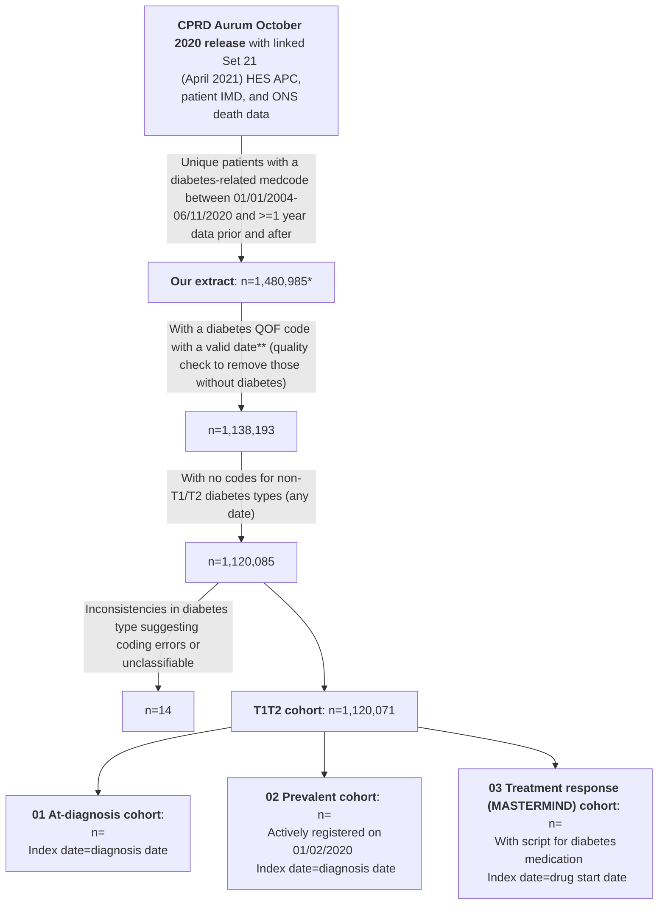
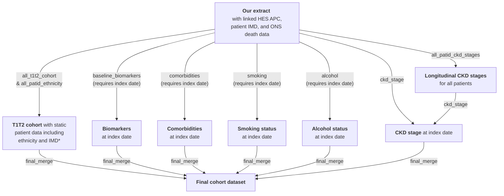

# CPRD Aurum Cohort scripts

## Introduction

This repository contains the R scripts used by the Exeter Diabetes team to produce three cohorts and their associated biomarker/comorbidity/sociodemographic data from a CPRD Aurum dataset: 
* An **'at-diagnosis'** cohort
* A **prevalent** cohort (registered at 01/02/2020)
* A **treatment response** (MASTERMIND) cohort (those initiating diabetes medications)

The below diagram outlines the data processing steps involved in creating these cohorts.

\* Extract actually contained n=1,481,294 unique patients (1,481,884 in total but some duplicates) but included n=309 with registration start dates in 2020 (which did not fulfil the extract criteria of having a diabetes-related medcode between 01/01/2004-06/11/2020 and >=1 year of data after this; some of these were also not 'acceptable' by [CPRD's definition](https://cprd.com/sites/default/files/2023-02/CPRD%20Aurum%20Glossary%20Terms%20v2.pdf)). See next section for further details on the extract.
&nbsp;

\** A valid date is an obsdate (for medcodes) which is no earlier than the patient's date of birth (no earlier than the month of birth if date of birth is not available; no earlier than full date of birth if this is available), no later than the patient's date of death (earliest of cprd_ddeath (Patient table) and dod/dor where dod not available (ONS death data)) where this is present, no later than deregistration where this is present, and no later than the last collection date from the Practice.

&nbsp;

## Extract details
Patients with a diabetes-related medcode ([full list here](https://github.com/Exeter-Diabetes/CPRD-Katie-MASTERMIND-Scripts/blob/main/Extract-details/diab_med_codes_2020.txt)) in the Observation table were extracted from the October 2020 CPRD Aurum release. See below for full inclusion criteria:

&nbsp;

&nbsp;

## Script overview

The below diagram shows the R scripts (in grey boxes) used to create the final cohorts (at-diagnosis, prevalent, and treatment response).

\*IMD=Index of Multiple Deprivation; 'static' because we only have data from 2015.

&nbsp;

Each of the three final cohorts (at-diagnosis, prevalent, and treatment response) contains static patient data e.g. ethnicity, IMD and diabetes type from the T1T2 cohort dataset, plus biomarker, comorbidity, and sociodemographic (smoking/alcohol) data at the (cohort-specific) index date.

This directory contains the scripts which are common to all three cohorts: 'all_patid_ckd_stages', 'all_patid_ethnicity', and 'all_t1t2_cohort'. These pull out static patient characteristics or features based on longitudinal data which may go beyond the index date of the cohorts (e.g. all_patid_ethnicity uses ethnicity codes from all time for each patient, which may occur later than the index date for a cohort).

In addition, this directory contains templates for the scripts which pull out data relative to the cohort index dates ('baseline_biomarkers', 'comorbidities', 'smoking', 'alcohol', 'ckd_stage' and 'final_merge'). The final cohorts each use tailored versions of these to account for the different index dates, the different biomarkers/comorbidities required for the different cohorts, and different additional inclusion/exclusion criteria which are applied in the 'final_merge' script. In addition to these differences, the cohorts have different additional scripts which pull in additional information e.g. the treatment response cohort also has biomarker responses (6/12 month post-index) and post-index comorbidity occurrences, used to evaluate treatment response.

The exact 'tailored' and additional scripts used to create each cohort dataset can be found in the relevant subdirectory: [01-At-diagnosis](https://github.com/Exeter-Diabetes/CPRD-Cohort-scripts/tree/main/01-At-diagnosis), [02-Prevalent](https://github.com/Exeter-Diabetes/CPRD-Cohort-scripts/tree/main/02-Prevalent), [03-Treatment-response-(MASTERMIND)](https://github.com/Exeter-Diabetes/CPRD-Cohort-scripts/tree/main/03-Treatment-response-(MASTERMIND)), along with a data dictionary of all variables in the final cohort dataset.

&nbsp;

## Script details

Data from CPRD was provided as raw text files which were imported into a MySQL database using a custom-built package ([aurum](https://github.com/Exeter-Diabetes/CPRD-analysis-package)) built by Dr Robert Challen. This package also includes functions to allow easy querying of the MySQL tables from R, using the 'dbplyr' tidyverse package. Codelists used for querying the data (denoted as 'codes${codelist_name}' in scripts) can be found in our [CPRD-Codelists repository](https://github.com/Exeter-Diabetes/CPRD-Codelists). 

Our [CPRD-Codelists repository](https://github.com/Exeter-Diabetes/CPRD-Codelists) also contains more details on the algorithms used to define variables such as ethnicity and diabetes type - see individual scripts for links to the appropriate part of the CPRD-Codelists repository.

| Script description | &nbsp;&nbsp;&nbsp;&nbsp;&nbsp;&nbsp;&nbsp;&nbsp;&nbsp;&nbsp;&nbsp;&nbsp;&nbsp;&nbsp;&nbsp;&nbsp;&nbsp;&nbsp;&nbsp;&nbsp;&nbsp;&nbsp;&nbsp;&nbsp;&nbsp;&nbsp;&nbsp;&nbsp;&nbsp;&nbsp;&nbsp;&nbsp;&nbsp;&nbsp;Outputs&nbsp;&nbsp;&nbsp;&nbsp;&nbsp;&nbsp;&nbsp;&nbsp;&nbsp;&nbsp;&nbsp;&nbsp;&nbsp;&nbsp;&nbsp;&nbsp;&nbsp;&nbsp;&nbsp;&nbsp;&nbsp;&nbsp;&nbsp;&nbsp;&nbsp;&nbsp;&nbsp;&nbsp;&nbsp;&nbsp;&nbsp;&nbsp;&nbsp;&nbsp; |
| ---- | ---- |
| **all_patid_ckd_stages**:  uses eGFR calculated from serum creatinine to define longitudinal CKD stages for all patids as per [our algorithm](https://github.com/Exeter-Diabetes/CPRD-Codelists#ckd-chronic-kidney-disease-stage) |  **all_patid_ckd_stages_from_algorithm**:  1 row per patid, with onset of different CKD stages in wide format |
| **all_patid_ethnicity**:  uses GP and linked HES data to define ethnicity as per [our algorithm](https://github.com/Exeter-Diabetes/CPRD-Codelists#ethnicity)  | **all_patid_ethnicity**:  1 row per patid, with 5-category, 16-category and QRISK2-category ethnicity (where available) |
| **all_t1t2_cohort**: table of patids meeting the criteria for our mixed Type 1/Type 2 diabetes cohort plus additional patient variables | **all_t1t2_cohort**: 1 row per patid of those in the T1/T2 cohort, with diabetes diagnosis dates, DOB, gender, ethnicity etc. |
|**baseline_biomarkers**:  pulls biomarkers value at cohort index dates | **{cohort_prefix}\_baseline_biomarkers**: 1 row per patid-index date combination with with all biomarker values at index date where available (including HbA1c and height) |
|**comorbidities**:  finds onset of comorbidities relative to cohort index dates | **{cohort_prefix}\_comorbidities**:  1 row per patid-index date combination, with earliest pre-index code occurrence and latest pre-index code occurrence |
|**smoking**:  finds smoking status at cohort index dates | **{cohort_prefix}\_smoking**: 1 row per patid-index date combination, with smoking status and QRISK2 smoking category at index date where available |
|**alcohol**:  finds alcohol status at cohort index dates | **{cohort_prefix}\_alcohol**: 1 row per patid-index date combination, with alcohol status at index date where available |
|**ckd_stage**:  finds onset of CKD stages relative to cohort index dates | **{cohort_prefix}\_ckd_stages**: 1 row per patid-index date combination, with baseline CKD stage at index date where available |
