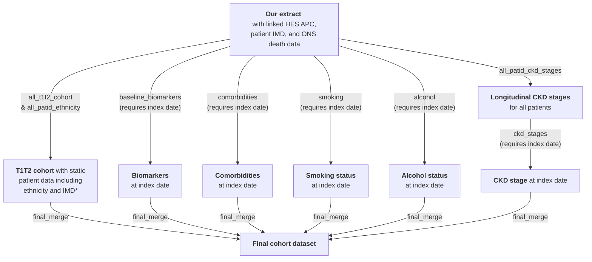

# CPRD Aurum Cohort scripts

## Introduction

This repository contains the R scripts used by the Exeter Diabetes team to produce three cohorts and their associated biomarker/comorbidity/sociodemographic data from a CPRD Aurum dataset: 
* An **'at-diagnosis'** cohort
* A **prevalent** cohort (registered at 01/02/2020)
* A **treatment response** (MASTERMIND) cohort (those initiating diabetes medications)

The below diagram outlines the data processing steps involved in creating these cohorts.

\* Extract actually contained n=1,481,294 unique patients (1,481,884 in total but some duplicates) but included n=309 with registration start dates in 2020 (which did not fulfil the extract criteria of having a diabetes-related medcode between 01/01/2004-06/11/2020 and >=1 year of data after this; some of these were also not 'acceptable' by [CPRD's definition](https://cprd.com/sites/default/files/2023-02/CPRD%20Aurum%20Glossary%20Terms%20v2.pdf)). NB: removing those with registration start date in 2020 also removed all of those with a 'patienttypeid' not equal to 3 ('regular'). See next section for further details on the extract.
&nbsp;

\** A valid date is an obsdate (for medcodes) which is no earlier than the patient's date of birth (no earlier than the month of birth if date of birth is not available; no earlier than full date of birth if this is available), no later than the patient's date of death (earliest of cprd_ddeath (Patient table) and dod/dor where dod not available (ONS death data)) where this is present, no later than deregistration where this is present, and no later than the last collection date from the Practice.

&nbsp;

## Extract details
Patients with a diabetes-related medcode ([full list here](https://github.com/Exeter-Diabetes/CPRD-Katie-MASTERMIND-Scripts/blob/main/Extract-details/diab_med_codes_2020.txt)) in the Observation table were extracted from the October 2020 CPRD Aurum release. See below for full inclusion criteria:

&nbsp;

&nbsp;

## Script overview

The below diagram shows the R scripts (in grey boxes) used to create the final cohorts (at-diagnosis, prevalent, and treatment response).

\*IMD=Index of Multiple Deprivation; 'static' because we only have data from 2015.

&nbsp;

Each of the three final cohorts (at-diagnosis, prevalent, and treatment response) contains static patient data e.g. ethnicity, IMD and diabetes type from the T1T2 cohort dataset, plus biomarker, comorbidity, and sociodemographic (smoking/alcohol) data at the (cohort-specific) index date.

This directory contains the scripts which are common to all three cohorts: 'all_patid_ckd_stages', 'all_patid_ethnicity', and 'all_t1t2_cohort'. These pull out static patient characteristics or features based on longitudinal data which may go beyond the index date of the cohorts (e.g. all_patid_ethnicity uses ethnicity codes from all time for each patient, which may occur later than the index date for a cohort).

In addition, this directory contains templates for the scripts which pull out data relative to the cohort index dates ('baseline_biomarkers', 'comorbidities', 'smoking', 'alcohol', 'ckd_stages' and 'final_merge'). The final cohorts each use tailored versions of these to account for the different index dates, the different biomarkers/comorbidities required for the different cohorts, and different additional inclusion/exclusion criteria which are applied in the 'final_merge' script. In addition to these differences, the cohorts have different additional scripts which pull in additional information e.g. the treatment response cohort has a 'drug_sorting_and_combos' script which defines the drug start dates which are used as the index dates, as well as scripts for biomarker responses (6/12 month post-index), which are used to evaluate treatment response.

The exact 'tailored' and additional scripts used to create each cohort dataset can be found in the relevant subdirectory: [01-At-diagnosis](https://github.com/Exeter-Diabetes/CPRD-Cohort-scripts/tree/main/01-At-diagnosis), [02-Prevalent](https://github.com/Exeter-Diabetes/CPRD-Cohort-scripts/tree/main/02-Prevalent), [03-Treatment-response-(MASTERMIND)](https://github.com/Exeter-Diabetes/CPRD-Cohort-scripts/tree/main/03-Treatment-response-(MASTERMIND)), along with a data dictionary of all variables in the final cohort dataset.

&nbsp;

## Script details

Data from CPRD was provided as raw text files which were imported into a MySQL database using a custom-built package ([aurum](https://github.com/Exeter-Diabetes/CPRD-analysis-package)) built by Dr Robert Challen. This package also includes functions to allow easy querying of the MySQL tables from R, using the 'dbplyr' tidyverse package. Codelists used for querying the data (denoted as 'codes${codelist_name}' in scripts) can be found in our [CPRD-Codelists repository](https://github.com/Exeter-Diabetes/CPRD-Codelists). 

Our [CPRD-Codelists repository](https://github.com/Exeter-Diabetes/CPRD-Codelists) also contains more details on the algorithms used to define variables such as ethnicity and diabetes type - see individual scripts for links to the appropriate part of the CPRD-Codelists repository.

| Script description | &nbsp;&nbsp;&nbsp;&nbsp;&nbsp;&nbsp;&nbsp;&nbsp;&nbsp;&nbsp;&nbsp;&nbsp;&nbsp;&nbsp;&nbsp;&nbsp;&nbsp;&nbsp;&nbsp;&nbsp;&nbsp;&nbsp;&nbsp;&nbsp;&nbsp;&nbsp;&nbsp;&nbsp;&nbsp;&nbsp;&nbsp;&nbsp;&nbsp;&nbsp;Outputs&nbsp;&nbsp;&nbsp;&nbsp;&nbsp;&nbsp;&nbsp;&nbsp;&nbsp;&nbsp;&nbsp;&nbsp;&nbsp;&nbsp;&nbsp;&nbsp;&nbsp;&nbsp;&nbsp;&nbsp;&nbsp;&nbsp;&nbsp;&nbsp;&nbsp;&nbsp;&nbsp;&nbsp;&nbsp;&nbsp;&nbsp;&nbsp;&nbsp;&nbsp; |
| ---- | ---- |
| **all_patid_ckd_stages**: uses eGFR calculated from serum creatinine to define longitudinal CKD stages for all patids as per [our algorithm](https://github.com/Exeter-Diabetes/CPRD-Codelists#ckd-chronic-kidney-disease-stage) |  **all_patid_ckd_stages_from_algorithm**:  1 row per patid, with onset of different CKD stages in wide format |
| **all_patid_ethnicity**: uses GP and linked HES data to define ethnicity as per [our algorithm](https://github.com/Exeter-Diabetes/CPRD-Codelists#ethnicity)  | **all_patid_ethnicity**:  1 row per patid, with 5-category, 16-category and QRISK2-category ethnicity (where available) |
| **all_t1t2_cohort**: table of patids meeting the criteria for our mixed Type 1/Type 2 diabetes cohort plus additional patient variables | **all_t1t2_cohort**: 1 row per patid of those in the T1/T2 cohort, with diabetes diagnosis dates, DOB, gender, ethnicity etc. |
|**template_baseline_biomarkers**: pulls biomarkers value at cohort index dates | **{cohort_prefix}\_baseline_biomarkers**: 1 row per patid-index date combination with with all biomarker values at index date where available (including HbA1c and height) |
|**template_comorbidities**: finds onset of comorbidities relative to cohort index dates | **{cohort_prefix}\_comorbidities**:  1 row per patid-index date combination, with earliest pre-index date code occurrence, latest pre-index date code occurrence, and earliest post-index date code occurrence |
|**template_smoking**: finds smoking status at cohort index dates | **{cohort_prefix}\_smoking**: 1 row per patid-index date combination, with smoking status and QRISK2 smoking category at index date where available |
|**template_alcohol**: finds alcohol status at cohort index dates | **{cohort_prefix}\_alcohol**: 1 row per patid-index date combination, with alcohol status at index date where available |
|**template_ckd_stages**: finds onset of CKD stages relative to cohort index dates | **{cohort_prefix}\_ckd_stages**: 1 row per patid-index date combination, with baseline CKD stage at index date where available |
|**template_final_merge**: pulls together variables from all of the above tables and adds age and diabetes duration at index date | **{cohort_prefix}\_final_merge**: 1 row per patid-index date combination with relevant biomarker/comorbidity/smoking/alcohol variables |

&nbsp;

## Data dictionary of variables in 'final_merge' table

| Variable name | Description | Notes on derivation |
| --- | --- | --- |
| gender | gender (1=male, 2=female) | |
| dob | date of birth | if month and date missing, 1st July used, if date but not month missing, 15th of month used, or earliest medcode in year of birth if this is earlier |
| pracid | practice ID | |
| prac_region | practice region: 1=North East, 2=North West, 3=Yorkshire And The Humber, 4=East Midlands, 5=West Midlands, 6=East of England, 7=South West, 8=South Central, 9=London, 10=South East Coast, 11 Northern Ireland, 12 Scotland, 13 Wales | |
| has_insulin | has a prescription for insulin ever (excluding invalid dates - before DOB / after LCD/death/deregistration) | |
| type1_code_count | number of Type 1-specific codes in records (any date) | |
| type2_code_count | number of Type 2-specific codes in records (any date) | |
| dm_diag_dmcodedate | earliest diabetes medcode (excluding those with obstypeid=4 (family history) and invalid dates) | |
| dm_diag_hba1cdate | earliest HbA1c >47.5 mmol/mol (excluding invalid dates, including those with valid value and unit codes only) | |
| dm_diag_ohadate | earliest OHA prescription (excluding invalid dates) | |
| dm_diag_insdate | earliest insulin prescription (excluding invalid dates) | |
| dm_diag_date | diabetes diagnosis date | earliest of dm_diag_dmcodedate, dm_diag_hba1cdate, dm_diag_ohadate, and dm_diag_insdate. It's worth noting that we have a number of people classified as Type 2 who appear to have been diagnosed at a young age, which is likely to be a coding error. This small proportion shouldn't affect any analysis results greatly, but might need to be considered for other analysis |
| dm_diag_codetype | whether diagnosis date represents diabetes medcode (1), high HbA1c (2), OHA prescription (3) or insulin (4) - if multiple on same day, use lowest number | |
| dm_diag_flag | whether diagnosis date is <91 days following registration | |
| dm_diag_age | age at diabetes diagnosis | dm_diag_date - dob See above note next to dm_diag_date_all variable on young diagnosis in T2Ds |
| dm_diag_before_reg | whether diagnosed before registration | |
| ins_in_1_year | whether started insulin within 1 year of diagnosis (**0 may mean no or missing**) | |
| current_oha | whether prescription for insulin within last 6 months of data | last 6 months of data = those before LCD/death/deregistration |
| diabetes_type | diabetes type | See [algorithm](https://github.com/Exeter-Diabetes/CPRD-Codelists#diabetes-algorithms) NB: we now have a few 'unclassified's - not included in any T2D cohorts. Date/age of diagnosis, time to insulin from diagnosis, and whether diagnosis is before registration is likely to be unreliable for these people. See above note next to dm_diag_date_all variable on young diagnosis in T2Ds |
| regstartdate | registration start date | |
| gp_record_end | earliest of last collection date from practice, deregistration and 31/10/2020 (latest date in records) | |
| death_date | earliest of 'cprddeathdate' (derived by CPRD) and ONS death date | NA if no death date |
| with_hes | 1 for patients with HES linkage and n_patid_hes<=20, otherwise 0| |

